# Deck of Lenses · 中文对照

Source: https://deck.artofgamedesign.com/

Jesse Schell · Unofficial AI translation. 未经人工审校的 AI 翻译草稿。

原文及插画权利归原权利人所有。经仓库所有者确认获准备份与翻译。

## 目录

- [1 · 情感](#lens-1)
- [2 · 核心体验](#lens-2)
- [3 · 游玩场所](#lens-3)
- [4 · 惊喜](#lens-4)
- [5 · 乐趣](#lens-5)
- [6 · 好奇心](#lens-6)
- [7 · 内生价值](#lens-7)
- [8 · 问题解决](#lens-8)
- [9 · 四大基本要素](#lens-9)
- [10 · 全息设计](#lens-10)
- [11 · 统一](#lens-11)
- [12 · 共鸣](#lens-12)
- [13 · 无限灵感](#lens-13)
- [14 · 问题陈述](#lens-14)
- [15 · 八道过滤器](#lens-15)
- [16 · 风险缓解](#lens-16)
- [17 · 玩具](#lens-17)
- [18 · 热情](#lens-18)
- [19 · 玩家](#lens-19)
- [20 · 愉悦](#lens-20)
- [21 · 心流](#lens-21)
- [22 · 需求](#lens-22)
- [23 · 动机](#lens-23)
- [24 · 新奇感](#lens-24)
- [25 · 评判](#lens-25)
- [26 · 功能空间](#lens-26)
- [27 · 时间](#lens-27)
- [28 · 状态机](#lens-28)
- [29 · 秘密](#lens-29)
- [30 · 涌现](#lens-30)
- [31 · 行动](#lens-31)
- [32 · 目标](#lens-32)
- [33 · 规则](#lens-33)
- [34 · 技能](#lens-34)
- [35 · 期望值](#lens-35)
- [36 · 运气](#lens-36)
- [37 · 公平](#lens-37)
- [38 · 挑战](#lens-38)
- [39 · 有意义的选择](#lens-39)
- [40 · 三角性](#lens-40)
- [41 · 技能与运气](#lens-41)
- [42 · 头脑与双手](#lens-42)
- [43 · 竞争](#lens-43)
- [44 · 合作](#lens-44)
- [45 · 竞争与合作](#lens-45)
- [46 · 奖励](#lens-46)
- [47 · 惩罚](#lens-47)
- [48 · 简单与复杂](#lens-48)
- [49 · 优雅](#lens-49)
- [50 · 个性](#lens-50)
- [51 · 想象力](#lens-51)
- [52 · 经济](#lens-52)
- [53 · 平衡](#lens-53)
- [54 · 易上手性](#lens-54)
- [55 · 可见进展](#lens-55)
- [56 · 并行性](#lens-56)
- [57 · 金字塔](#lens-57)
- [58 · 谜题](#lens-58)
- [59 · 控制](#lens-59)
- [60 · 物理界面](#lens-60)
- [61 · 虚拟界面](#lens-61)
- [62 · 透明性](#lens-62)
- [63 · 反馈](#lens-63)
- [64 · 丰润反馈](#lens-64)
- [65 · 原始本能](#lens-65)
- [66 · 通道与维度](#lens-66)
- [67 · 模式](#lens-67)
- [67½ · 隐喻](#lens-67-5)
- [68 · 时刻](#lens-68)
- [69 · 兴趣曲线](#lens-69)
- [70 · 内在吸引力](#lens-70)
- [71 · 美](#lens-71)
- [72 · 投射](#lens-72)
- [73 · 故事机器](#lens-73)
- [74 · 障碍](#lens-74)
- [75 · 简单与超越](#lens-75)
- [76 · 英雄之旅](#lens-76)
- [77 · 最奇怪的事物](#lens-77)
- [78 · 故事](#lens-78)
- [79 · 自由](#lens-79)
- [80 · 帮助](#lens-80)
- [81 · 间接控制](#lens-81)
- [82 · 共谋](#lens-82)
- [83 · 幻想](#lens-83)
- [84 · 世界](#lens-84)
- [85 · 化身](#lens-85)
- [86 · 角色功能](#lens-86)
- [87 · 角色特质](#lens-87)
- [88 · 人际环状模型](#lens-88)
- [89 · 角色关系网](#lens-89)
- [90 · 地位](#lens-90)
- [91 · 角色转变](#lens-91)
- [92 · 内在矛盾](#lens-92)
- [93 · 无名特质](#lens-93)
- [93½ · 临场感](#lens-93-5)
- [94 · 氛围](#lens-94)
- [95 · 观赏性](#lens-95)
- [95½ · 可作弊性](#lens-95-5)
- [96 · 友谊](#lens-96)
- [97 · 表达](#lens-97)
- [98 · 社群](#lens-98)
- [99 · 恶意滋扰](#lens-99)
- [100 · 热爱](#lens-100)
- [101 · 团队](#lens-101)
- [102 · 文档](#lens-102)
- [103 · 试玩测试](#lens-103)
- [104 · 技术](#lens-104)
- [105 · 水晶球](#lens-105)
- [106 · 乌托邦](#lens-106)
- [107 · 客户](#lens-107)
- [108 · 提案](#lens-108)
- [109 · 利润](#lens-109)
- [110 · 改变](#lens-110)
- [111 · 责任](#lens-111)
- [112 · 渡鸦](#lens-112)
- [∞ · 你的秘密目的](#lens-113)

## 1 · 情感

Review: ai-draft

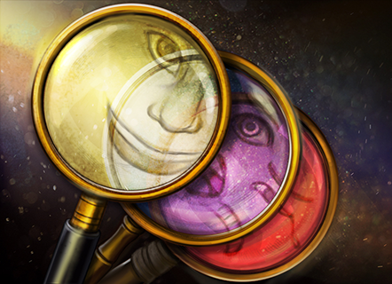

The Lens of Emotion

情感透镜

~People may forget what you said, but they'll never forget how  you made them feel.
                                      -Maya Angelou~

To make sure the emotions you create are the right ones, ask yourself these questions:

~人们也许会忘记你说过什么，但永远不会忘记你带给他们的感受。
                                      ——玛雅·安吉洛~

为了确保你营造的是恰当的情感，请问自己以下问题：

1. What emotions would I like my player to experience?  Why?

我希望玩家体验哪些情感？为什么？

2. What emotions are players (including me) having when they play now?  Why?

玩家（包括我自己）现在游玩时产生了哪些情感？为什么？

3. How can I bridge the gap between the emotions players are having and the emotions I'd like them to have?

我如何弥合玩家实际感受到的情感与我希望他们感受到的情感之间的差距？

Artist credit: Rachel Dorrett

## 2 · 核心体验

Review: ai-draft

The Lens of Essential Experience

核心体验透镜

To use this lens, stop thinking about your game, and start thinking about the experience of the player.  Ask yourself these questions:

使用这面透镜时，先别再思考游戏本身，转而思考玩家的体验。请问自己以下问题：

1. What experience do I want the player to have?

我想让玩家获得怎样的体验？

2. What is essential to the experience?

这种体验的核心是什么？

3. How can my game capture that essence?

我的游戏如何抓住这个核心？

Artist credit: Zachary D. Coe

## 3 · 游玩场所

Review: ai-draft

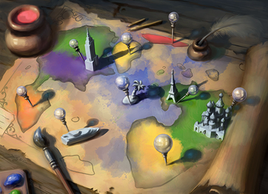

The Lens of Venue

游玩场所透镜

The places that we play exert tremendous influence on the design of our games.  To make sure you aren't designing in a vacuum, ask yourself these questions:

游玩的场所对游戏设计有着巨大的影响。为了确保你的设计没有脱离实际环境，请问自己以下问题：

1. What type of venue best suits the game I'm trying to create?

哪种场所最适合我想创作的游戏？

2. Does my venue have special properties that will influence my game?

我的游玩场所有哪些会影响游戏的特殊属性？

3. What elements of my game are in harmony with my venue?  What elements are not?

游戏中的哪些要素与游玩场所相契合？哪些不契合？

Artist credit: Zachary D. Coe

## 4 · 惊喜

Review: ai-draft

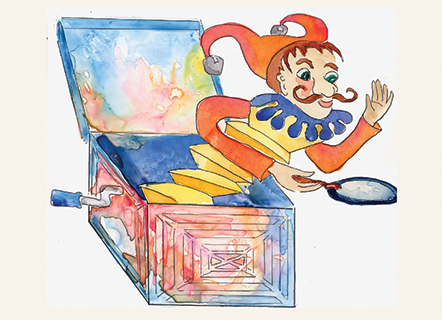

The Lens of Surprise

惊喜透镜

Surprise is so basic that we can easily forget about it.  Use this lens to remind yourself to fill your game with interesting surprises.  Ask yourself these questions:

惊喜是如此基本，以至于我们很容易忘记它。用这面透镜提醒自己，让游戏充满有趣的惊喜。请问自己以下问题：

1. What will surprise players when they play my game?

玩家游玩我的游戏时，什么会让他们感到惊喜？

2. Does the story in my game have surprises?  Do the game rules?  Does the artwork?  The technology?

游戏的故事中有惊喜吗？规则呢？美术呢？技术呢？

3. Do your rules give players ways to surprise each other?

规则是否让玩家有机会给彼此带来惊喜？

4. Do your rules give players ways to surprise themselves?

规则是否让玩家有机会给自己带来惊喜？

Artist credit: Diana Patton

## 5 · 乐趣

Review: ai-draft

The Lens of Fun

乐趣透镜

Fun is desirable in nearly every game, though sometimes fun defies analysis.  To maximize your game's fun, ask yourself these questions:

几乎所有游戏都希望带来乐趣，尽管乐趣有时难以分析。为了尽可能提升游戏的乐趣，请问自己以下问题：

1. What parts of my game are fun?

游戏的哪些部分有趣？

2. What parts need to be more fun?

哪些部分需要变得更有趣？

Artist credit: Jon Schulte

## 6 · 好奇心

Review: ai-draft

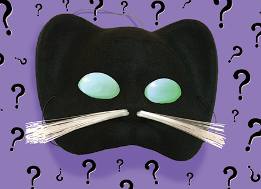

The Lens of Curiosity

好奇心透镜

To use this lens, think about the player's true motivations - not just the goals your game has set forth, but the reason the player wants to achieve those goals.  Ask yourself these questions:

使用这面透镜时，要思考玩家真正的动机——不只是游戏设定的目标，还包括玩家想要达成这些目标的原因。请问自己以下问题：

1. What questions does my game put into the player's mind?

我的游戏在玩家心中引发了哪些疑问？

2. What am I doing to make them care about these questions?

我做了什么，让他们在意这些疑问？

3. What can I do to make them invent even more questions?

我能做些什么，让他们自己提出更多疑问？

Artist credit: Emma Backer

## 7 · 内生价值

Review: ai-draft

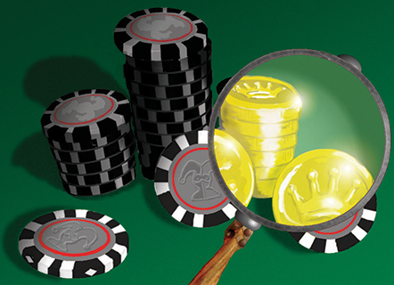

The Lens of Endogenous Value

内生价值透镜

To use this lens, think about your players' feelings about items, objects, and scoring in your game.  Ask yourself these questions:

使用这面透镜时，要思考玩家对游戏中的道具、物件和得分的感受。请问自己以下问题：

1. What is valuable to the players in my game?

在我的游戏中，什么对玩家有价值？

2. How can I make it more valuable to them?

我如何让这些东西对他们更有价值？

3. What is the relationship between value in the game and the players' motivations?

游戏内的价值与玩家的动机有怎样的关系？

Artist credit: Melanie Lam

## 8 · 问题解决

Review: ai-draft

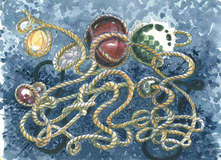

The Lens of Problem Solving

问题解决透镜

Every game has problems to solve.  To use this lens, think about the problems your players must solve to succeed at your game.  Ask yourself these questions:

每个游戏都有需要解决的问题。使用这面透镜时，要思考玩家必须解决哪些问题，才能在游戏中取得成功。请问自己以下问题：

1. What problems does my game ask the players to solve?

我的游戏要求玩家解决哪些问题？

2. Are there hidden problems to solve that arise as part of gameplay?

游玩过程中是否会产生需要解决的隐藏问题？

3. How can my game generate new problems so that players keep coming back?

我的游戏如何产生新问题，让玩家不断回来？

Artist credit: Cheryl Ceol

## 9 · 四大基本要素

Review: ai-draft

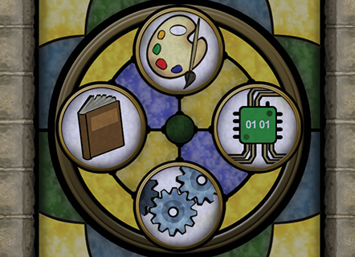

The Lens of The Elemental Tetrad

四大基本要素透镜

To use this lens, take stock of what your game is truly made of.  Consider each element separately, and then all of them together as a whole.  Ask yourself these questions:

使用这面透镜时，要盘点游戏真正由什么构成。先分别考察每种要素，再将它们作为整体考察。请问自己以下问题：

1. Is my game design using elements of all four types (Aesthetics, Technology, Mechanics and Story)?

我的游戏设计是否使用了全部四类要素（美感、技术、机制和故事）？

2. Could my design be improved by enhancing elements in one or more of the categories?

加强其中一类或多类要素，能否改进我的设计？

3. Are the four elements in harmony, reinforcing each other, and working together toward a common theme?

这四类要素是否协调一致、相互强化，并共同服务于同一个主题？

Artist credit: Reagan Heller

## 10 · 全息设计

Review: ai-draft

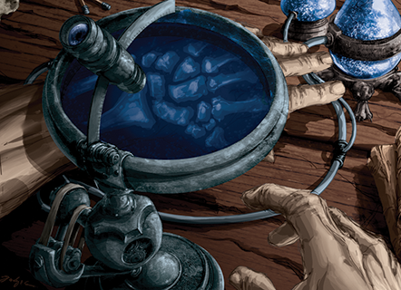

The Lens of Holographic Design

全息设计透镜

To use this lens, you must simultaneously see your game structure and the player experience.  You may shift your focus from one to the other, but it is far better to view your game and experience holographically.

使用这面透镜时，你必须同时看到游戏结构和玩家体验。你可以在两者之间切换注意力，但以全息的方式同时看待游戏与体验会好得多。

1. What elements of the game make the experience enjoyable?

游戏中的哪些要素让体验愉快？

2. What elements of the game may detract from the experience?

游戏中的哪些要素可能损害体验？

3. How can I change game elements to improve the experience?

我如何改变游戏要素来改善体验？

Artist credit: Zachary D. Coe

## 11 · 统一

Review: ai-draft

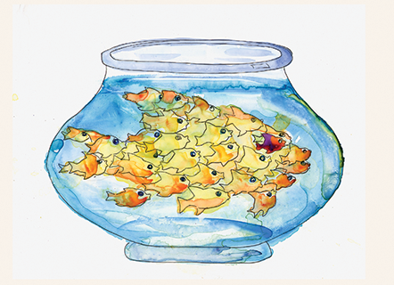

The Lens of Unification

统一透镜

To use this lens, consider the reason behind it all.  Ask yourself these questions:

使用这面透镜时，要思考这一切背后的原因。请问自己以下问题：

1. What is my theme?

我的主题是什么？

2. Am I using every means possible to reinforce that theme?

我是否在用一切可能的手段强化这个主题？

Artist credit: Diana Patton

## 12 · 共鸣

Review: ai-draft

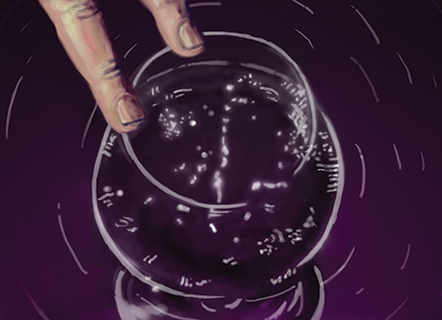

The Lens of Resonance

共鸣透镜

To use the Lens of Resonance, you must look for hidden power.  Ask yourself these questions:

使用共鸣透镜时，你必须寻找隐藏的力量。请问自己以下问题：

1. What is it about my game that feels powerful and special?

我的游戏有哪些地方让人觉得强大而独特？

2. When I describe my game to people, what ideas get them really excited?

当我向别人描述游戏时，哪些想法让他们特别兴奋？

3. If I had no constraints of any kind, what would this game be like?

如果没有任何限制，这个游戏会是什么样子？

4. I have certain instincts about how this game should be.  What is driving those instincts?

对于游戏应该是什么样，我有一些直觉。是什么在驱动这些直觉？

Artist credit: Nick Daniel

## 13 · 无限灵感

Review: ai-draft

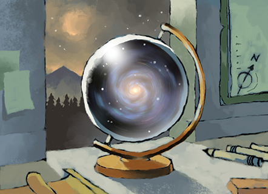

The Lens of Infinite Inspiration

无限灵感透镜

~When you know how to listen, everybody is the guru.
                                  - Ram Dass~

To use this lens, stop looking at your game, or games like it.  Instead, look everywhere else.  Ask yourself these questions:

~当你懂得倾听，每个人都是导师。
                                  ——拉姆·达斯~

使用这面透镜时，先别再看自己的游戏，也别看类似的游戏，而要把目光投向其他一切地方。请问自己以下问题：

1. What is an experience I have had in my life that I want to share with others?

在我的人生中，有什么体验是我想与他人分享的？

2. In what small way can I capture the essence of that experience and put it into my game?

我能用怎样的小方式，抓住这种体验的精髓，并将它融入游戏？

Artist credit: Sam Yip

## 14 · 问题陈述

Review: ai-draft

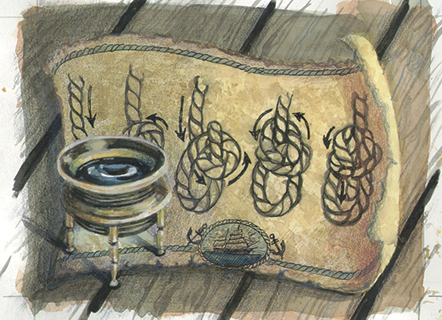

The Lens of The Problem Statement

问题陈述透镜

To use this lens, think of your game as the solution to the problem.  Ask yourself these questions:

使用这面透镜时，把游戏看作某个问题的解决方案。请问自己以下问题：

1. What problem, or problems, am I really trying to solve?

我真正想解决的是哪一个或哪些问题？

2. Have I been making assumptions about this game that really have nothing to do with its true purpose?

我是否对这个游戏作出了一些实际上与其真正目的毫无关系的假设？

3. Is a game really the best solution?  Why?

游戏真的是最好的解决方案吗？为什么？

4. How will I be able to tell if the problem is solved?

我如何判断问题是否已解决？

Artist credit: Cheryl Ceol

## 15 · 八道过滤器

Review: ai-draft

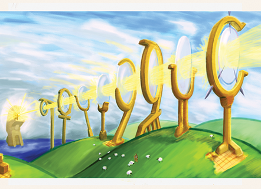

The Lens of The Eight Filters

八道过滤器透镜

To use this lens, you must consider the many constraints on your design.  Your design is only finished when it can pass through all eight filters without requiring a change.  Ask yourself these questions:

使用这面透镜时，你必须考虑设计面临的各种约束。只有当设计能通过全部八道过滤器而不需要修改时，它才算完成。请问自己以下问题：

1. Does this game feel right?

这个游戏给人的感觉对吗？

2. Will the intended audience like this game enough?

目标受众会足够喜欢这个游戏吗？

3. Is this a well-designed game?

这是一个设计精良的游戏吗？

4. Is this game novel enough?

这个游戏足够新颖吗？

5. Will this game sell?

这个游戏卖得出去吗？

6. Is it technically possible to build this game?

从技术上说，这个游戏能做出来吗？

7. Does this game meet our social and community goals?

这个游戏是否符合我们的社会目标与社群目标？

8. Do the playtesters enjoy this game enough?

试玩者是否足够享受这个游戏？

Artist credit: Chris Daniel

## 16 · 风险缓解

Review: ai-draft

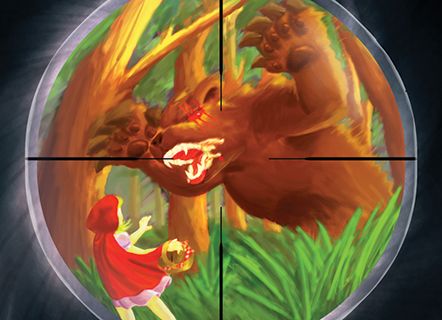

The Lens of Risk Mitigation

风险缓解透镜

~Because the sage always confronts difficulties, he never experiences them.
                                  - Tao Te Ching~

To use this lens, stop thinking positively, and start to seriously consider the things that could go horribly wrong with your game.  Ask yourself these questions:

~夫唯难之，故终无难。
                                  ——《道德经》~

使用这面透镜时，先放下乐观的想法，认真考虑游戏可能遭遇的严重问题。请问自己以下问题：

1. What could keep this game from being great?

什么可能阻碍这个游戏变得出色？

2. How can we stop that from happening?

我们如何阻止这些情况发生？

Artist credit: Chris Daniel

## 17 · 玩具

Review: ai-draft

The Lens of The Toy

玩具透镜

To use this lens, stop thinking about whether your game is fun to play, and start thinking about whether it is fun to play WITH.  Ask yourself these questions:

使用这面透镜时，先别再想你的游戏玩起来是否有趣，而要想把它当作玩具摆弄是否有趣。请问自己以下问题：

1. If my game had no goal, would it be fun at all?  If not, how can I change that?

如果我的游戏没有目标，它还会有趣吗？如果不会，我如何改变这一点？

2. When people see my game, do they want to start interacting with it, even before they know what to do?  If not, how can I change that?

人们看到我的游戏时，是否还没弄明白要做什么，就想开始与它互动？如果不会，我如何改变这一点？

Artist credit: Camilla Kydland

## 18 · 热情

Review: ai-draft

The Lens of Passion

热情透镜

At the end of each prototype, when you are carefully mitigating risks and planning what to do next, don't forget to check how you feel about your game with these important questions:

每完成一个原型，当你认真缓解风险、规划下一步时，别忘了通过以下重要问题检查自己对游戏的感受：

1. Am I filled with blinding passion about how great this game will be?

一想到这个游戏将会多么出色，我是否就满怀近乎盲目的热情？

2. If I've lost the passion, can I find it again?

如果我失去了热情，还能找回来吗？

3. If the passion isn't coming back, shouldn't I be doing something else?

如果热情再也回不来，我是否该去做别的事情？

Artist credit: Rachel Dorrett

## 19 · 玩家

Review: ai-draft

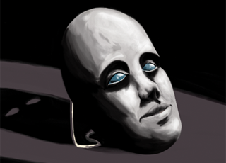

The Lens of The Player

玩家透镜

To use this lens, stop thinking about your game, and start thinking about your player.  Ask yourself these questions about the people who will play your game:

使用这面透镜时，先别再思考游戏，转而思考玩家。针对将会游玩你游戏的人，请问自己以下问题：

1. In general, what do they like?

一般而言，他们喜欢什么？

2. What don't they like?  Why?

他们不喜欢什么？为什么？

3. What do they expect to see in a game?

他们期待在游戏里看到什么？

4. If I were in their place, what would I want to see in a game?

如果我处在他们的位置，我想在游戏里看到什么？

5. What will they like or dislike about my game in particular?

具体来说，他们会喜欢或不喜欢我的游戏的哪些地方？

Artist credit: Nick Daniel

## 20 · 愉悦

Review: ai-draft

The Lens of Pleasure

愉悦透镜

To use this lens, think about the kinds of pleasure your game does and does not provide.  Ask yourself these questions:

使用这面透镜时，要思考游戏提供了哪些愉悦，又没有提供哪些愉悦。请问自己以下问题：

1. What pleasures does my game give to players?  Can these be improved?

我的游戏带给玩家哪些愉悦？能进一步改善吗？

2. What pleasures are missing from my game's experience?  Why?  Can they be added?

我的游戏体验缺少哪些愉悦？为什么？可以加入吗？

Artist credit: Jim Rugg

## 21 · 心流

Review: ai-draft

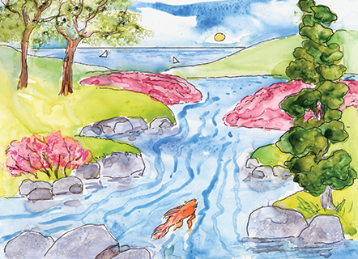

The Lens of Flow

心流透镜

To use this lens, consider what is holding your player's focus.  Ask yourself these questions:

使用这面透镜时，要思考是什么在维持玩家的专注。请问自己以下问题：

1. Does my game have clear goals?  If not, how can I fix that?

我的游戏有清晰的目标吗？如果没有，我如何修正？

2. Are the goals of the player the same goals I intended?

玩家追求的目标与我设想的目标一致吗？

3. Do parts of the game distract players so they forget their goal?  If so, can these distractions be reduced, or tied into the game goals?

游戏的某些部分是否会分散玩家的注意力，让他们忘记目标？如果会，能否减少这些干扰，或将其与游戏目标联系起来？

4. Does my game provide a steady stream of gradually increasing challenges?

我的游戏是否持续提供难度逐渐增加的挑战？

5. Are the player's skills improving as expected?  If not, how can I change that?

玩家的技能是否按预期提升？如果没有，我如何改变这一点？

Artist credit: Diana Patton

## 22 · 需求

Review: ai-draft

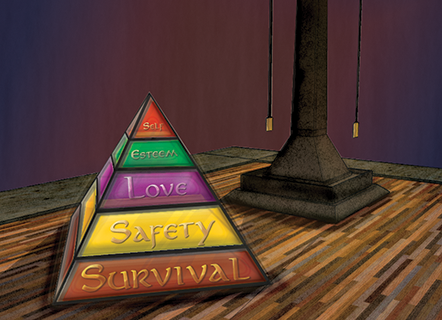

The Lens of Needs

需求透镜

To use this lens, stop thinking about your game, and start thinking about what basic human needs it fulfills.  Ask yourself these questions:

使用这面透镜时，先别再思考游戏本身，转而思考它满足了哪些人类基本需求。请问自己以下问题：

1. On which levels of Maslow's hierarchy is my game operating?

我的游戏作用于马斯洛需求层次中的哪些层次？

2. Does it fill the needs of competence, autonomy, and relatedness?

它是否满足了胜任、自主和联结的需求？

3. How can I make my game fulfill more basic needs than it already does?

我如何让游戏满足比现在更多的基本需求？

4. For the needs my game is already filling, how can it fill those needs even better?

对于游戏已经满足的需求，它如何满足得更好？

Artist credit: Chuck Hoover

## 23 · 动机

Review: ai-draft

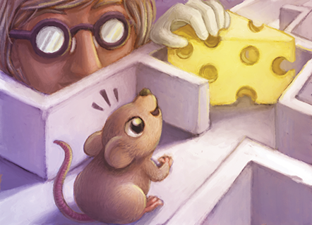

The Lens of Motivation

动机透镜

Every game is a complex ecosystem of motivations.  To examine them more closely, ask yourself these questions:

每个游戏都是一个复杂的动机生态系统。为了更仔细地审视这些动机，请问自己以下问题：

1. What motivations do players have to play my game?

玩家有哪些动机来玩我的游戏？

2. Which motivations are most internal?  Which are most external?

哪些动机最偏向内在？哪些最偏向外在？

3. Which are pleasure seeking?  Which are pain avoiding?

哪些动机是在寻求愉悦？哪些是在回避痛苦？

4. Which motivations support each other?

哪些动机相互支持？

5. Which motivations are in conflict?

哪些动机相互冲突？

Artist credit: Dan Lin

## 24 · 新奇感

Review: ai-draft

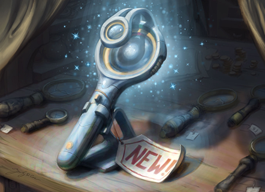

The Lens of Novelty

新奇感透镜

~Different isn't always better, but better is always different.
                             - Scotty Meltzer~

To ensure you harness the powerful motivation of novelty, ask yourself these questions:

~不同未必更好，但更好一定有所不同。
                             ——斯科蒂·梅尔策~

为了确保你运用好新奇感这一强大动机，请问自己以下问题：

1. What is novel about my game?

我的游戏有什么新奇之处？

2. Does my game have novelties throughout or just at the beginning?

我的游戏是全程都有新鲜事物，还是只有开头有？

3. Do I have the right mix of the novel and the familiar?

我是否恰当地混合了新奇与熟悉的事物？

4. When the novelty wears off, will players still enjoy my game?

当新奇感消退后，玩家还会享受我的游戏吗？

Artist credit: Zachary D. Coe

## 25 · 评判

Review: ai-draft

The Lens of Judgment

评判透镜

To decide if your game is a good judge of the players, ask yourself these questions:

为了判断游戏是否能恰当地评判玩家，请问自己以下问题：

1. What does my game judge about the players?

我的游戏在评判玩家的哪些方面？

2. How does it communicate this judgment?

它如何传达这种评判？

3. Do players feel the judgment is fair?

玩家觉得评判公平吗？

4. Do they care about the judgment?

他们在意这种评判吗？

5. Does the judgment make them want to improve?

这种评判会让他们想要进步吗？

Artist credit: Joseph Grubb

## 26 · 功能空间

Review: ai-draft

The Lens of Functional Space

功能空间透镜

To use this lens, think about the space in which your game really takes place when all surface elements are stripped away.  Ask yourself these questions:

使用这面透镜时，要思考剥离所有表面要素后，游戏真正发生的空间。请问自己以下问题：

1. Is the space of this game discrete or continuous?

这个游戏的空间是离散的还是连续的？

2. How many dimensions does it have?

它有多少个维度？

3. What are the boundaries of the space?

空间的边界是什么？

4. Are there sub-spaces?  How are they connected?

存在子空间吗？它们如何连接？

5. Is there more than one useful way to abstractly model the space of this game?

是否有不止一种有用的方法，可以对这个游戏的空间建立抽象模型？

Artist credit: Cheryl Ceol

## 27 · 时间

Review: ai-draft

The Lens of Time

时间透镜

It is said that "timing is everything".  Our goal as designers is to create experiences, and experiences are easily spoiled when they are too short or too long.  Ask yourself these questions to make yours just the right length:

人们常说“时机决定一切”。作为设计师，我们的目标是创造体验，而体验过短或过长，都很容易被破坏。为了让体验的时长恰到好处，请问自己以下问题：

1. What is it that determines the length of my gameplay activities?

是什么决定了游戏中各项活动的时长？

2. Are my players frustrated because the game ends too early, or bored because the game is too long?

玩家是否因游戏结束得太早而沮丧，或因游戏太长而无聊？

3. Setting a time limit can make gameplay more exciting.  Is it a good idea for my game?

设置时间限制可以让游玩更刺激。这适合我的游戏吗？

4. Would a hierarchy of time structures help my game?

分层的时间结构会对我的游戏有所帮助吗？

Artist credit: Sam Yip

## 28 · 状态机

Review: ai-draft

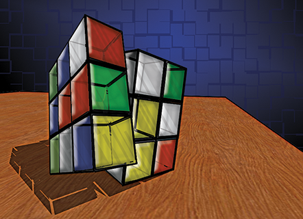

The Lens of The State Machine

状态机透镜

To use this lens, think about what information changes during your game.  Ask yourself these questions:

使用这面透镜时，要思考游戏过程中哪些信息会发生变化。请问自己以下问题：

1. What are the objects in my game?

我的游戏中有哪些对象？

2. What are the attributes of the objects?

这些对象有哪些属性？

3. What are the possible states for each attribute?

每个属性有哪些可能的状态？

4. What triggers the state changes for each attribute?

什么会触发每个属性的状态变化？

Artist credit: Chuck Hoover

## 29 · 秘密

Review: ai-draft

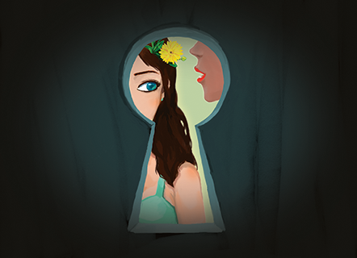

The Lens of Secrets

秘密透镜

Change who has what information, and you change your game completely.  To use this lens, think about who knows what and why.

改变谁掌握什么信息，就能彻底改变游戏。使用这面透镜时，要思考谁知道什么，以及为什么。

1. What is known by the game only?

哪些信息只有游戏系统知道？

2. What is known by all players?

哪些信息所有玩家都知道？

3. What is known by some or only one player?

哪些信息只有部分玩家或某一个玩家知道？

4. Would changing who knows what information improve my game in some way?

改变谁掌握哪些信息，是否能在某些方面改进我的游戏？

Artist credit: Lilian Qian

## 30 · 涌现

Review: ai-draft

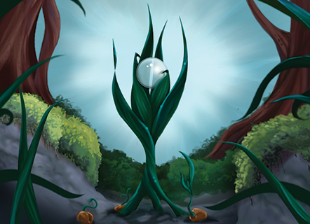

The Lens of Emergence

涌现透镜

To make sure your game has interesting qualities of emergence, ask yourself these questions:

为了确保游戏具有有趣的涌现特性，请问自己以下问题：

1. How may verbs do my players have?

玩家有多少种可用的动作（动词）？

2. How many objects can each verb act on?

每种动作可以作用于多少种对象？

3. How many ways can players achieve their goals?

玩家有多少种方式可以达成目标？

4. How many subjects do the players control?

玩家控制多少个行动主体？

5. How do side effects change constraints?

附带效果会如何改变约束？

Artist credit: Reagan Heller

## 31 · 行动

Review: ai-draft

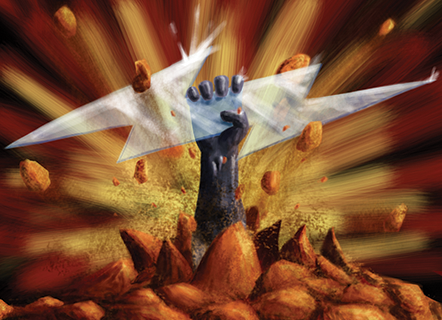

The Lens of Action

行动透镜

To use this lens, think about what your players can do and what they can't, and why.  Ask yourself these questions:

使用这面透镜时，要思考玩家能做什么、不能做什么，以及为什么。请问自己以下问题：

1. What are the basic actions in my game?

我的游戏中有哪些基本行动？

2. What are the strategic actions?

有哪些策略行动？

3. What strategic actions would I like to see?  How can I change my game in order to make those possible?

我希望看到哪些策略行动？我如何修改游戏，让这些行动成为可能？

4. Am I happy with the ratio of strategic to basic actions?

我对策略行动与基本行动的比例满意吗？

5. What actions do players wish they could do in my game that they cannot?  Can I somehow enable these, either as basic or strategic actions?

玩家希望在游戏中采取、却无法采取哪些行动？我能否以某种方式让这些行动成为可能，无论是作为基本行动还是策略行动？

Artist credit: Nick Daniel

## 32 · 目标

Review: ai-draft

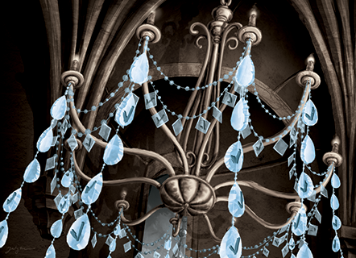

The Lens of Goals

目标透镜

To ensure the goals of your game are appropriate and well balanced, ask yourself these questions:

为了确保游戏目标恰当且平衡良好，请问自己以下问题：

1. What is the ultimate goal of my game?

我的游戏的最终目标是什么？

2. Is that goal clear to players?

玩家清楚这个目标吗？

3. If there are a series of goals, do the players understand that?

如果存在一系列目标，玩家理解这一点吗？

4. Are the different goals related to each other in a meaningful way?

不同目标之间是否存在有意义的联系？

5. Are my goals concrete, achievable and rewarding?

我的目标是否具体、可达成，而且值得追求？

6. Do I have a good balance of short and long term goals?

短期目标与长期目标之间是否平衡得当？

7. Do players have a chance to decide their own goals?

玩家有机会决定自己的目标吗？

Artist credit: Zachary D. Coe

## 33 · 规则

Review: ai-draft

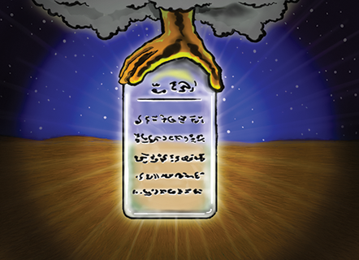

The Lens of Rules

规则透镜

To use this lens, look deep into your game until you can make out its most basic structure.  Ask yourself these questions:

使用这面透镜时，要深入观察游戏，直到能辨认出它最基本的结构。请问自己以下问题：

1. What are the foundational rules of my game?  How do these differ from the operational rules?

我的游戏有哪些基础规则？它们与操作规则有什么不同？

2. Are there "laws" or "house rules" that are forming as the game develops?  Should these be incorporated into my game directly?

随着游戏发展，是否出现了“惯例”或“自定规则”？是否应该将它们直接纳入游戏？

3. Are there different modes in my game?  Do they make things simpler, or more complex?  Would the game be better with more or less modes?

我的游戏有不同模式吗？它们让事情更简单，还是更复杂？增加或减少模式，会让游戏更好吗？

4. Who enforces the rules?

由谁执行规则？

5. Are the rules easy to understand, or are they confusing?  If confusing, should I change the rules or explain them more clearly?

规则容易理解，还是令人困惑？如果令人困惑，我应该修改规则，还是把规则解释得更清楚？

Artist credit: Joshua Seaver

## 34 · 技能

Review: ai-draft

The Lens of Skill

技能透镜

To use this lens, stop looking at your game, and start looking at the skills you are asking of the players.  Ask yourself these questions:

使用这面透镜时，先别再看游戏本身，转而观察你对玩家提出的技能要求。请问自己以下问题：

1. What skills does my game require from the player?

我的游戏要求玩家具备哪些技能？

2. Are there categories of skill that this game is missing?

这个游戏是否缺少某些类别的技能？

3. Which skills are dominant?

哪些技能占主导地位？

4. Are these skills creating the experience I want?

这些技能是否在创造我想要的体验？

5. Are some players much better at these skills than others?

有些玩家是否在这些技能上远胜于其他人？

6. Does this make the game feel unfair?

这会让游戏显得不公平吗？

7. Can players improve their skills with practice?

玩家能通过练习提升技能吗？

8. Does this game demand the right level of skill?

这个游戏要求的技能水平是否恰当？

Artist credit: Emma Backer

## 35 · 期望值

Review: ai-draft

The Lens of Expected Value

期望值透镜

To use this lens, think about the chance of different events occurring in your game, and what those mean to your player.  Ask yourself these questions:

使用这面透镜时，要思考游戏中不同事件发生的概率，以及它们对玩家意味着什么。请问自己以下问题：

1. What is the actual chance of a certain event occurring?

某个事件实际发生的概率是多少？

2. What is the perceived chance?

玩家感知到的概率是多少？

3. What value does the outcome of that event have?  Can the value be quantified?  Are there intangible aspects of value that I am not considering?

这个事件的结果具有怎样的价值？这种价值可以量化吗？是否存在我尚未考虑的无形价值？

4. Each action a player can take has a different expected value.  Am I happy with these values?  Do they give the player interesting choices?  Are they too rewarding, or too punishing?

玩家可以采取的每种行动都有不同的期望值。我对这些值满意吗？它们是否给玩家带来了有趣的选择？它们的奖励是否过多，或惩罚是否过重？

Artist credit: Nick Daniel

## 36 · 运气

Review: ai-draft

The Lens of Chance

运气透镜

To use this lens, focus on the parts of your game that involve randomness and risk, keeping in mind that those two things are not the same.  Ask yourself these questions:

使用这面透镜时，要关注游戏中涉及随机性和风险的部分，并记住这两者并不相同。请问自己以下问题：

1. What in my game is truly random? What parts just feel random?

游戏中什么是真正随机的？哪些部分只是让人感觉随机？

2. Does the randomness give the players positive feelings of excitement and challenge, or negative feelings of hopelessness and lack of control?

随机性带给玩家的是兴奋与挑战等积极感受，还是绝望与失控等消极感受？

3. Would changing my probability distribution curves improve my game?

改变概率分布曲线能否改进我的游戏？

4. Do players have the opportunity to take interesting risks?

玩家有机会承担有趣的风险吗？

5. What is the relationship between chance and skill in my game?

我的游戏中，运气与技能是什么关系？

Artist credit: Joshua Seaver

## 37 · 公平

Review: ai-draft

The Lens of Fairness

公平透镜

To use this lens, evaluate the game from each player's point of view and skill level.  Find a way to give each player a chance of winning that each will consider to be fair.  Ask yourself these questions:

使用这面透镜时，要从每位玩家的视角和技能水平出发评估游戏。找到一种方法，让每位玩家都有自己认为公平的获胜机会。请问自己以下问题：

1. Should my game be symmetrical?  Why?

我的游戏应该是对称的吗？为什么？

2. Should my game be asymmetrical?  Why?

我的游戏应该是非对称的吗？为什么？

3. Which is more important: that my game is a reliable measure of who has the most skill, or that it provide an interesting challenge to all players?

什么更重要：让游戏可靠地衡量谁的技能最强，还是为所有玩家提供有趣的挑战？

4. If I want players of different skill levels to play together, what means will I use to make the game interesting and challenging for everyone?

如果我希望不同技能水平的玩家一起游玩，我将采用什么方式，让游戏对每个人都有趣且有挑战性？

Artist credit: Nick Daniel

## 38 · 挑战

Review: ai-draft

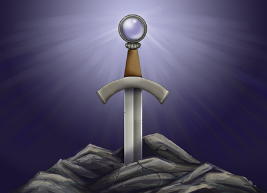

The Lens of Challenge

挑战透镜

Challenge is at the core of almost all gameplay.  You could even say that a game is defined by its goals and challenges.  When examining the challenges of your game, ask yourself these questions:

挑战是几乎所有游戏玩法的核心。甚至可以说，游戏由其目标与挑战来定义。审视游戏中的挑战时，请问自己以下问题：

1. What are the challenges in my game?

我的游戏有哪些挑战？

2. Are they too easy, too hard, or just right?

它们是太简单、太难，还是恰到好处？

3. Can my challenges accommodate a wide variety of skill levels?

我的挑战能适应多种不同的技能水平吗？

4. How does the level of challenge increase as the player succeeds?

随着玩家取得成功，挑战难度如何提升？

5. Is there enough variety in the challenges?

挑战是否足够多样？

6. What is the maximum level of challenges in my game?

我的游戏中，挑战的最高难度是什么？

Artist credit: Reagan Heller

## 39 · 有意义的选择

Review: ai-draft

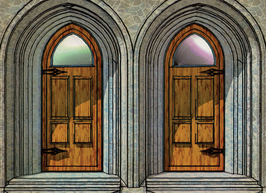

The Lens of Meaningful Choices

有意义的选择透镜

When we make meaningful choices, it lets us feel like the things we do matter.  To use this lens, ask yourself these questions:

当我们作出有意义的选择时，就会觉得自己的行为举足轻重。使用这面透镜时，请问自己以下问题：

1. What choices am I asking the players to make?

我在要求玩家作出哪些选择？

2. Are they meaningful?  How?

这些选择有意义吗？意义何在？

3. Am I giving the player the right number of choices?  Would more make them feel more powerful?  Would fewer make the game clearer?

我给玩家的选择数量是否恰当？更多选择会让他们觉得更有力量吗？更少选择会让游戏更清晰吗？

4. Are there any dominant strategies in my game?

我的游戏中是否存在占优策略？

Artist credit: Chuck Hoover

## 40 · 三角性

Review: ai-draft

The Lens of Triangularity

三角性透镜

Giving a player the choice to play it safe for a low reward, or to take a risk for a big reward is a great way to make your game interesting and exciting.  To use this lens, ask yourself these questions:

让玩家选择稳妥行事以获得较小回报，或冒险以争取较大回报，是让游戏有趣且刺激的好方法。使用这面透镜时，请问自己以下问题：

1. Do I have triangularity now?  If not, how can I get it?

我的游戏现在具有这种三角性吗？如果没有，如何加入？

2. Is my attempt at triangularity balanced?  That is, are the rewards commensurate with the risks?

我设计的三角性是否平衡？也就是说，回报是否与风险相称？

Artist credit: Nick Daniel

## 41 · 技能与运气

Review: ai-draft

The Lens of Skill vs Chance

技能与运气透镜

To help determine how to balance skill and chance in your game, ask yourself these questions:

为了帮助确定如何平衡游戏中的技能与运气，请问自己以下问题：

1. Are my players here to be judged (skill), or to take risks (chance)?

玩家来这里是为了接受评判（技能），还是承担风险（运气）？

2. Skill tends to be more serious that chance: Is my game serious or casual?

依靠技能通常比依靠运气更严肃：我的游戏是严肃型还是休闲型？

3. Are parts of my game tedious?  If so, will adding elements of chance enliven them?

游戏中是否有枯燥的部分？如果有，加入随机要素能否让它们活跃起来？

4. Do parts of my game feel too random?  If so, will replacing elements of chance with elements of skill and strategy make the players feel more in control?

游戏中的某些部分是否让人觉得太随机？如果是，用技能与策略要素替换随机要素，能否让玩家更有掌控感？

Artist credit: Nathan Mazur

## 42 · 头脑与双手

Review: ai-draft

The Lens of Head and Hands

头脑与双手透镜

To make sure your game has a good balance of mental and physical elements, use this lens.  Ask yourself these questions:

用这面透镜确保游戏中的脑力与身体要素平衡得当。请问自己以下问题：

1. Are my players looking for mindless action, or an intellectual challenge?

玩家想要的是不用动脑的动作体验，还是智力挑战？

2. Would adding more places that involve puzzle solving in my game make it more interesting?

在游戏中增加需要解谜的地方，会让它更有趣吗？

3. Are there places where the player can relax their brain, and just play the game without thinking?

是否有些地方能让玩家放松头脑，不必思考，只管游玩？

4. Can I give the player a choice - either succeed by exercising a high level of dexterity, or by finding a clever strategy that works with a minimum of physical skill?

我能否让玩家自由选择——凭借高超的操作技巧取胜，或找到一种只需极少身体技能的巧妙策略？

5. If "1" means all physical, and "10" means all mental, what number would my game get?

如果“1”代表完全依靠身体，“10”代表完全依靠脑力，我的游戏应该得几分？

Artist credit: Lisa Brown

## 43 · 竞争

Review: ai-draft

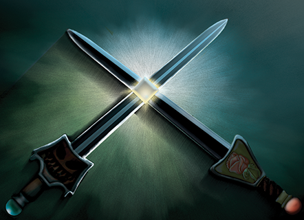

The Lens of Competition

竞争透镜

Competitive games can satisfy the basic human urge to determine who is the most skilled.  Use this lens to ensure that people want to win your game.  Ask yourself these questions:

竞争性游戏可以满足人类想知道谁技艺最强的基本冲动。用这面透镜确保人们想赢得你的游戏。请问自己以下问题：

1. Does my game give a fair measurement of player skill?

我的游戏能公平地衡量玩家技能吗？

2. Do people want to win my game?  Why?

人们想在我的游戏中获胜吗？为什么？

3. Is winning this game something people can be proud of?  Why?

赢得这个游戏是否值得自豪？为什么？

4. Can novices meaningfully compete at my game?

新手能在我的游戏中进行有意义的竞争吗？

5. Can experts meaningfully compete at my game?

高手能在我的游戏中进行有意义的竞争吗？

6. Can experts generally be sure they will defeat novices?

高手通常能确信自己会击败新手吗？

Artist credit: Elizabeth Barndollar

## 44 · 合作

Review: ai-draft

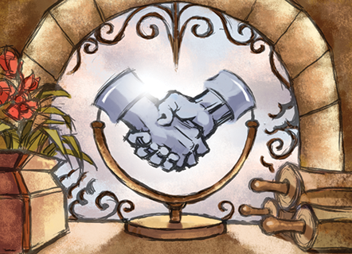

The Lens of Cooperation

合作透镜

Collaborating and succeeding as a team is a special pleasure that can create lasting social bonds.  Use this lens to study the cooperative aspects of your game.  Ask yourself these questions:

作为团队协作并取得成功，是一种能够建立持久社会纽带的特殊愉悦。用这面透镜研究游戏中的合作。请问自己以下问题：

1. Cooperation requires communication.  Do my players have enough opportunity to communicate?  How could communication be enhanced?

合作需要沟通。玩家是否有足够的沟通机会？如何加强沟通？

2. Are my players friends already, or are they strangers?  If they are strangers, can I help them break the ice?

玩家已经是朋友，还是彼此陌生？如果是陌生人，我能帮助他们打破隔阂吗？

3. Is there synergy (2+2=5) or antergy (2+2=3) when the players work together?  Why?

玩家合作时产生的是协同增效（2+2=5），还是相互损耗（2+2=3）？为什么？

4. Do all the players have the same role, or do they have special jobs?

所有玩家的角色相同，还是各有专门的职责？

Artist credit: Sam Yip

## 45 · 竞争与合作

Review: ai-draft

The Lens of Competition vs Cooperation

竞争与合作透镜

Balancing competition and cooperation can be done in many interesting ways.  Use this lens to decide whether they are balanced properly in your game.  Ask yourself these questions:

可以用许多有趣的方式平衡竞争与合作。用这面透镜判断两者在游戏中的平衡是否恰当。请问自己以下问题：

1. If "1" is Competition and "10" is Cooperation, what number should my game get?

如果“1”代表竞争，“10”代表合作，我的游戏应该得几分？

2. Can I give players a choice whether to play cooperatively or competitively?

我能否让玩家选择以合作方式还是竞争方式游玩？

3. Does my audience prefer competition, cooperation, or a mix?

我的受众偏好竞争、合作，还是两者的混合？

4. Is my team competition something that makes sense for my game?  Is my game more fun with team competition, or with solo competition?

团队竞争是否适合我的游戏？团队竞争与个人竞争，哪一种让游戏更有趣？

Artist credit: Diana Patton

## 46 · 奖励

Review: ai-draft

The Lens of Reward

奖励透镜

Ask these questions to determine if your game is giving out the right rewards in the right amounts at the right times:

请用以下问题判断游戏是否在恰当的时间，以恰当的数量提供恰当的奖励：

1. What rewards is my game giving out now?  Can it give out others as well?

我的游戏目前提供哪些奖励？还能提供其他奖励吗？

2. Are players excited when they get rewards in my game, or are they bored by them?  Why?

玩家获得游戏奖励时，是兴奋还是厌倦？为什么？

3. Getting a reward you don't understand is like getting no reward at all.  Do my players understand their rewards?

得到不理解的奖励，就像根本没得到奖励一样。玩家理解他们获得的奖励吗？

4. Are the rewards my game gives out too regular?  Can they be given out in a more variable way?

游戏发放奖励是否过于规律？能否采用变化更多的方式？

5. How are my rewards related to one another?  Is there a way they could be better connected?

各项奖励之间有什么联系？能否让它们联系得更好？

6. How are my rewards building?  Too fast, too slow, just right?

奖励是如何逐步增加的？太快、太慢，还是恰到好处？

Artist credit: Elizabeth Barndollar

## 47 · 惩罚

Review: ai-draft

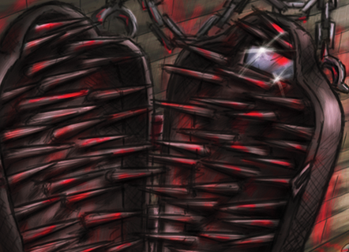

The Lens of Punishment

惩罚透镜

Punishment must be used delicately.  Balanced appropriately, it will make your game more meaningful, and provide successful players with a real sense of pride.  To examine the punishment in your game, ask yourself these questions:

惩罚必须谨慎使用。平衡得当时，它能让游戏更有意义，并让成功的玩家产生真正的自豪感。为了审视游戏中的惩罚，请问自己以下问题：

1. What are the punishments in my game?

我的游戏有哪些惩罚？

2. Why am I punishing the players?  What do I hope to achieve by it?

我为什么要惩罚玩家？我希望借此达到什么目的？

3. Do my punishments seem fair to the players?  Why or why not?

玩家觉得这些惩罚公平吗？为什么公平或不公平？

4. Is there a way to turn these punishments into rewards and get the same, or a better effect?

能否将这些惩罚转化为奖励，并获得相同或更好的效果？

5. Are my strong punishments balanced against commensurately strong rewards?

严厉的惩罚是否有相应丰厚的奖励来平衡？

Artist credit: Chris Daniel

## 48 · 简单与复杂

Review: ai-draft

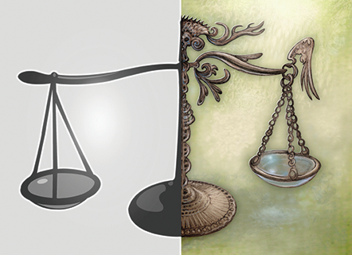

The Lens of Simplicity / Complexity

简单与复杂透镜

Striking the right balance between simplicity and complexity is difficult.  Use this lens to help your game become one in which meaningful complexity rises out of a simple system.  Ask yourself these questions:

在简单与复杂之间取得恰当平衡并不容易。用这面透镜帮助游戏从简单的系统中生长出有意义的复杂性。请问自己以下问题：

1. What elements of innate complexity do I have in my game?

我的游戏中有哪些内在复杂性？

2. Is there a way this innate complexity could be turned into emergent complexity?

能否将这种内在复杂性转化为涌现复杂性？

3. Do elements of emergent complexity arise from my game?  If not, why not?

我的游戏是否产生了涌现复杂性？如果没有，为什么？

4. Are there elements of my game that are too simple?

游戏中是否有过于简单的要素？

Artist credit: Tom Smith

## 49 · 优雅

Review: ai-draft

The Lens of Elegance

优雅透镜

Most "classic games" are considered to be masterpieces of elegance.  Use this lens to make your game as elegant as possible.  Ask yourself these questions:

大多数“经典游戏”都被视为优雅设计的杰作。用这面透镜让游戏尽可能优雅。请问自己以下问题：

1. What are the elements of my game?

我的游戏有哪些要素？

2. What are the purposes of each element?  Count these up to give the element an "elegance rating."

每个要素有哪些用途？数一数用途的数量，给这个要素一个“优雅评分”。

3. For elements with only one or two purposes, can some of these be combined into each other, or removed altogether?

对于只有一两个用途的要素，能否将其中一些相互合并，或干脆移除？

4. For elements with several purposes, is it possible for them to take on even more?

对于有多种用途的要素，能否让它们承担更多用途？

Artist credit: Joshua Seaver

## 50 · 个性

Review: ai-draft

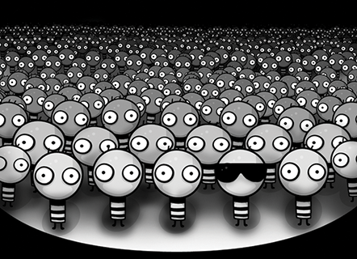

The Lens of Character

个性透镜

Elegance and character are opposites.  They are like miniature versions of simplicity and complexity, and must be kept in balance.  To make sure your game has lovable, defining quirks, ask yourself these questions:

优雅与个性相对而立。它们就像简单与复杂的微缩版本，必须保持平衡。为了确保游戏具有讨人喜欢、足以定义其特色的小怪癖，请问自己以下问题：

1. Is there anything strange in my game that players talk about excitedly?

我的游戏里是否有让玩家兴奋地谈论的奇特之处？

2. Does my game have funny qualities that make it unique?

我的游戏是否有使它独一无二的有趣特质？

3. Does my game have flaws that players like?

我的游戏是否有玩家喜欢的缺点？

Artist credit: Kyle Gabler

## 51 · 想象力

Review: ai-draft

The Lens of Imagination

想象力透镜

All games have some element of imagination, and some element of reality.  Use this lens to help find the balance between detail and imagination.  Ask yourself these questions:

所有游戏都包含一些想象要素和一些现实要素。用这面透镜帮助你在细节与想象之间找到平衡。请问自己以下问题：

1. What must the player understand to play my game?

玩家必须理解什么，才能游玩我的游戏？

2. Can some element of imagination help them understand that better?

某种想象要素能否帮助他们更好地理解？

3. What high quality, realistic details can we provide in this game?

我们能在游戏中提供哪些高质量、逼真的细节？

4. What details would be low quality if we provided them?  Can imagination fill the gap instead?

哪些细节即使做出来，质量也会较低？能否让想象力来填补这些空白？

5. Can I give details that the imagination will be able to reuse again and again?

我能否提供可供想象力反复利用的细节？

6. Which details inspire imagination?  Which stifle it?

哪些细节会激发想象力？哪些会压制想象力？

Artist credit: Elizabeth Barndollar

## 52 · 经济

Review: ai-draft

The Lens of Economy

经济透镜

Giving a game an economy can give it a surprising depth and a life all its own.  But like all living things, it can be difficult to control.  Use this lens to keep your economy in balance:

为游戏引入经济系统，能赋予它惊人的深度和属于自己的生命。但就像所有生命体一样，它也可能难以控制。用这面透镜让经济系统保持平衡：

1. How can my players earn money?  Should there be other ways?

玩家如何赚钱？是否应该有其他途径？

2. What can my players buy?  Why?

玩家可以买什么？为什么？

3. Is money too easy to get?  Too hard?  How can I change this?

金钱是否太容易获得？是否太难？我如何改变这一点？

4. Are choices about earning and spending meaningful ones?

关于赚钱与花钱的选择是否有意义？

5. Is a universal currency a good idea in my game, or should there be specialized currencies?

在我的游戏中，使用通用货币合适吗，还是应该设置专用货币？

Artist credit: Sam Yip

## 53 · 平衡

Review: ai-draft

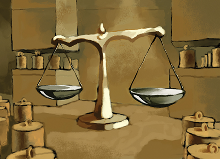

The Lens of Balance

平衡透镜

There are many types of game balance, and each is important.  However, it is easy to get lost in the details, and forget the big picture.  Use this simple lens to get out of the mire, and ask yourself the only important question:

游戏平衡有很多种，每一种都很重要。然而，我们很容易迷失在细节中，忘记全局。用这面简单的透镜走出困境，并问自己唯一重要的问题：

1. Does my game feel right?

我的游戏给人的感觉对吗？

Artist credit: Sam Yip

## 54 · 易上手性

Review: ai-draft

The Lens of Accessibility

易上手性透镜

When you present a puzzle (or a game of any kind) to the players, they should be able to clearly visualize what their first few steps would be.  Ask yourself these questions:

当你向玩家呈现一个谜题（或任何类型的游戏）时，他们应该能清楚地设想自己最初几步会做什么。请问自己以下问题：

1. How will players know how to begin solving my puzzle, or playing my game?  Do I need to explain it, or is it self-evident?

玩家如何知道该怎样开始解谜或游玩？我需要解释，还是一目了然？

2. Does my puzzle or game act like something they have seen before?  If it does, how can I draw attention to that similarity? If it does not, how can I make them understand how it behaves?

我的谜题或游戏的运作方式，是否像他们以前见过的某种东西？如果像，我如何让他们注意到这种相似？如果不像，我如何让他们理解它的运作方式？

3. Does my puzzle or game draw people in, and make them want to touch it and manipulate it?  If not, how can I change it so that it does?

我的谜题或游戏是否能吸引人，让人想触碰和操作它？如果不能，我如何修改，让它做到这一点？

Artist credit: Karen Phillips

## 55 · 可见进展

Review: ai-draft

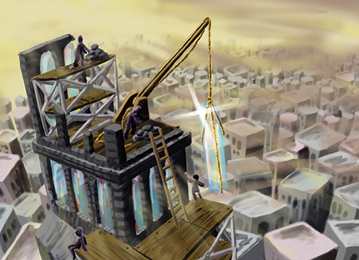

The Lens of Visible Progress

可见进展透镜

Players need to see that they are making progress when solving a difficult problem.  To make sure they are getting this feedback, ask yourself these questions:

解决困难问题时，玩家需要看到自己在取得进展。为了确保他们获得这种反馈，请问自己以下问题：

1. What does it mean to make progress in my game?

在我的游戏中，取得进展意味着什么？

2. Is there enough progress in my game?  Is there a way I can add more interim steps of progressive success?

游戏中的进展是否足够？能否增加更多逐步成功的中间阶段？

3. What progress is visible, and what progress is hidden?  Can I find a way to reveal what is hidden?

哪些进展可见，哪些进展隐藏着？我能找到方法，把隐藏的进展展示出来吗？

Artist credit: Nick Daniel

## 56 · 并行性

Review: ai-draft

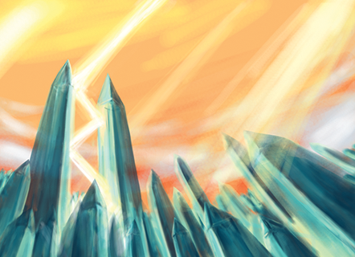

The Lens of Parallelism

并行性透镜

Parallelism in your puzzle brings parallel benefits to the player's experience.  To use this lens, ask yourself these questions:

让谜题具有并行性，也会为玩家体验带来相应的多重益处。使用这面透镜时，请问自己以下问题：

1. Are there bottlenecks in my design where players are unable to proceed if they cannot solve a particular challenge?  Could parallel challenges help?

我的设计是否存在瓶颈，让玩家只要无法解决某个特定挑战就不能继续？并行挑战能有所帮助吗？

2. Are my parallel challenges different enough from each other to give players the benefit of variety?

各项并行挑战是否足够不同，能让玩家享受到多样性的好处？

3. Can my parallel challenges be connected somehow?  Is there a way that making progress on one can make it easier to solve the others?

能否以某种方式连接并行挑战？能否让某项挑战的进展，使其他挑战更容易解决？

Artist credit: Nick Daniel

## 57 · 金字塔

Review: ai-draft

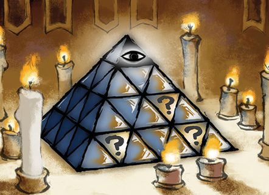

The Lens of The Pyramid

金字塔透镜

Pyramids fascinate us because they have a singular highest point.  To give your puzzle the allure of the ancient pyramids, ask yourself these questions:

金字塔令我们着迷，因为它有一个独一无二的最高点。为了让谜题具有古代金字塔般的吸引力，请问自己以下问题：

1. Is there a way all the pieces of my puzzle can feed into a singular challenge at the end?

能否让谜题的所有部分最终汇入一个共同的挑战？

2. Big pyramids are often made of little pyramids - can I have a hierarchy of ever more challenging puzzle elements, gradually leading to a final challenge?

大金字塔往往由小金字塔组成——我能否建立一个难度不断提升的谜题层级，逐步引向最终挑战？

3. Is the challenge at the top of my pyramid interesting, compelling, and clear?  Does it make people want to work in order to get to it?

金字塔顶端的挑战是否有趣、吸引人且清晰？它是否让人愿意努力抵达那里？

Artist credit: Sam Yip

## 58 · 谜题

Review: ai-draft

The Lens of The Puzzle

谜题透镜

Puzzles make the player stop and think.  To ensure your puzzles are doing everything you want to shape the player experience, ask yourself these questions:

谜题让玩家停下来思考。为了确保谜题充分发挥你期望的作用，塑造玩家体验，请问自己以下问题：

1. What the are the puzzles in my game?

我的游戏有哪些谜题？

2. Should I have more puzzles, or less?  Why?

谜题应该更多还是更少？为什么？

3. Which of the ten puzzle principles apply to each of my puzzles?

十大谜题原则中，哪些适用于我的每个谜题？

4. Do I have incongruous puzzles?  How can I better integrate them into the game?

是否有与游戏不协调的谜题？我如何让它们更好地融入游戏？

Artist credit: Elizabeth Barndollar

## 59 · 控制

Review: ai-draft

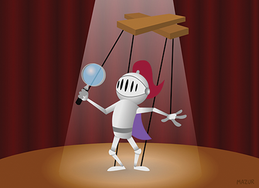

The Lens of Control

控制透镜

This lens has uses beyond just examining your interface, since meaningful control is essential for immersive interactivity.  To use this lens, ask yourself these questions:

这面透镜的用途不限于审视界面，因为有意义的控制是沉浸式互动的必要条件。使用这面透镜时，请问自己以下问题：

1. When players use the interface, does it do what they expected?  If not, why not?

玩家使用界面时，它的表现符合预期吗？如果不符合，为什么？

2. Intuitive interfaces give a feeling of control.  Is my interface easy to master, or hard to master?

直观的界面能带来掌控感。我的界面容易掌握，还是难以掌握？

3. Do my players feel they have a strong influence over the outcome of the game?  If not, how can I change that?

玩家是否觉得自己对游戏结果有很大影响？如果没有，我如何改变这一点？

4. Feeling powerful = feeling in control.  Do my players feel powerful?  Can I make them feel more powerful somehow?

感觉有力量＝感觉能掌控。玩家觉得自己有力量吗？我能否让他们感觉更有力量？

Artist credit: Nathan Mazur

## 60 · 物理界面

Review: ai-draft

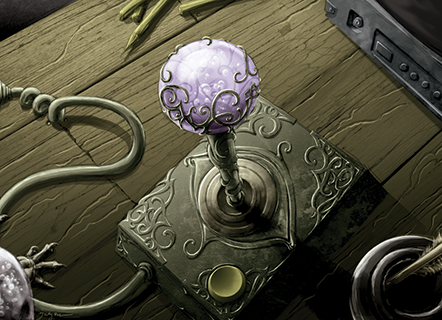

The Lens of Physical Interface

物理界面透镜

Somehow, the player has a physical interaction with your game.  Copying existing physical interfaces is an easy trap to fall into.  Use this lens to be sure that your physical interface is well suited to your game by asking these questions:

玩家总会以某种方式与游戏发生物理交互。照搬现有物理界面，是一个很容易掉进去的陷阱。用这面透镜确保物理界面适合游戏，请问自己以下问题：

1. What does the player pick up and touch?  Can this be made more pleasing?

玩家会拿起和触碰什么？能否让这种体验更愉悦？

2. How does this map the actions in the game world?  Can the mapping be more direct?

这些操作如何映射到游戏世界中的行动？映射能否更直接？

3. If I can't create a custom physical interface, what metaphor am I using when I map the inputs to the game world?

如果无法创造定制的物理界面，我在把输入映射到游戏世界时，使用了什么隐喻？

4. How does the physical interface look under the Lens of the Toy?

从玩具透镜来看，这个物理界面怎么样？

5. How does the player see, hear and touch the world of the game?  Is there a way to include a physical output device that will make the world become more real in the player's imagination?

玩家如何看见、听见和触碰游戏世界？能否加入某种物理输出设备，让这个世界在玩家的想象中更加真实？

Artist credit: Zachary D. Coe

## 61 · 虚拟界面

Review: ai-draft

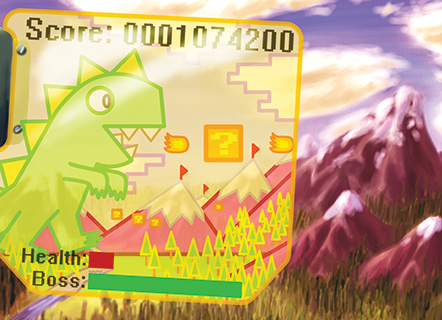

The Lens of Virtual Interface

虚拟界面透镜

Designing virtual interfaces can be very tricky.  Ask these questions to make sure that your virtual interface is enhancing player experience as much as possible:

设计虚拟界面可能相当棘手。请用以下问题确保虚拟界面尽可能改善玩家体验：

1. What information does a player need that isn't obvious just by looking at the game world?

玩家需要哪些仅凭观察游戏世界无法直接看出的信息？

2. When does the player need this information?

玩家什么时候需要这些信息？

3. How can this information be delivered to the player in a way that won't interfere with the player's interactions with the game world?

如何将这些信息传达给玩家，同时不干扰他们与游戏世界的互动？

4. Are there elements of the game world that are easier using a virtual interface (like a popup menu) than direct interaction?

游戏世界中是否有些要素，通过虚拟界面（例如弹出菜单）操作，比直接交互更容易？

5. What kind of virtual interface is best suited to my physical interface?

哪种虚拟界面最适合我的物理界面？

Artist credit: Chris Daniel

## 62 · 透明性

Review: ai-draft

The Lens of Transparency

透明性透镜

The ideal interface becomes invisible to the player letting the player's imagination be completely immersed in the game world.  To ensure invisibility, ask yourself these questions:

理想的界面会在玩家眼中隐去，让玩家的想象力完全沉浸于游戏世界。为了实现这种隐形效果，请问自己以下问题：

1. Does the interface let the players do what they want?

界面是否让玩家能做自己想做的事？

2. Do new players find the interface intuitive?

新玩家觉得界面直观吗？

3. Can players learn to use it without thinking?

玩家能学会不假思索地使用界面吗？

4. Can players continue to use the interface during stressful situations?

在紧张的情境下，玩家仍能使用界面吗？

5. Does something confuse players about the interface?  On which of the six interface arrows is it happening?

界面有什么地方让玩家困惑？问题发生在六条界面箭头中的哪一条？

6. Do players feel a sense of immersion when using the interface?

玩家使用界面时有沉浸感吗？

Artist credit: Jesse Schell

## 63 · 反馈

Review: ai-draft

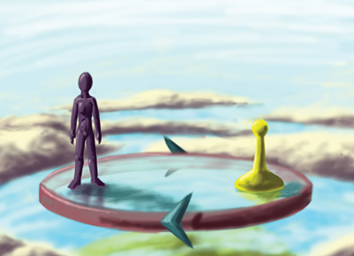

The Lens of Feedback

反馈透镜

The player's feedback from the game comes from many things:  judgment, reward, instruction, encouragement, and challenge.  Use this lens to be sure your feedback loop is creating the experience you want by continuously asking these questions:

玩家从游戏中获得的反馈有许多形式：评判、奖励、指引、鼓励和挑战。使用这面透镜，不断提出以下问题，确保反馈循环正在创造你想要的体验：

1. What do players need to know at this moment?

玩家此刻需要知道什么？

2. What do players want to know at this moment?

玩家此刻想知道什么？

3. What do I want players to feel at this moment?  How can I give feedback that creates that feeling?

我希望玩家此刻有什么感受？我如何通过反馈创造这种感受？

4. What do the players want to feel at this moment?  Is there an opportunity for them to create a situation where they will feel that?

玩家此刻想有什么感受？他们是否有机会创造一种能产生这种感受的情境？

5. What is the player's goal at this moment?  What feedback will help them toward that goal?

玩家此刻的目标是什么？什么反馈能帮助他们朝这个目标前进？

Artist credit: Nick Daniel

## 64 · 丰润反馈

Review: ai-draft

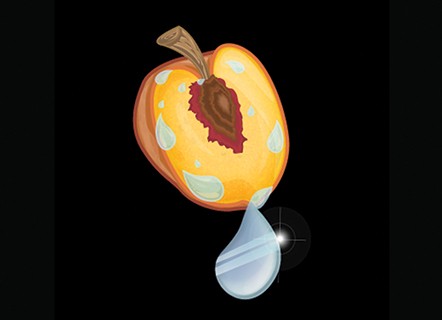

The Lens of Juiciness

丰润反馈透镜

Juicy interfaces are fun the moment you pick them up.  To maximize juiciness, ask yourself these questions:

反馈丰润的界面一上手就很有趣。为了尽可能提升这种丰润感，请问自己以下问题：

1. Is my interface giving the player continuous feedback for their actions?  If not, why not?

界面是否持续对玩家的行动提供反馈？如果没有，为什么？

2. Is second-order motion created by the actions of the player?  Is this motion powerful and interesting?

玩家的行动是否带来次级运动？这些运动是否有力且有趣？

3. Juicy systems reward the player many ways at once.  When I give the player a reward, how many ways am I simultaneously rewarding them?  Can I find more ways?

反馈丰润的系统会同时以多种方式奖励玩家。当我给玩家奖励时，我在同时以多少种方式奖励他们？还能找到更多方式吗？

Artist credit: Patrick Mittereder

## 65 · 原始本能

Review: ai-draft

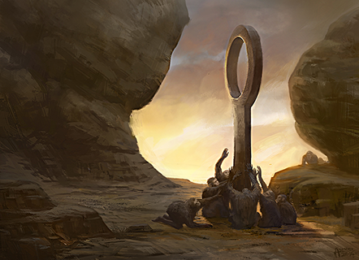

The Lens of Primality

原始本能透镜

Some actions and interfaces are so intuitive that animals were doing them millions of years ago.  To capture the power of primality, ask yourself these questions:

有些行动和界面直观到动物在数百万年前就已经会用了。为了发挥原始本能的力量，请问自己以下问题：

1. What parts of my game are so primal an animal could play?  Why?

我的游戏有哪些部分如此符合原始本能，连动物都能玩？为什么？

2. What parts of my game could be more primal?

游戏中的哪些部分可以更符合原始本能？

Artist credit: Astro Leon-Jhong

## 66 · 通道与维度

Review: ai-draft

The Lens of Channels and Dimensions

通道与维度透镜

Choosing how to map game information to channels and dimensions is the heart of designing your game interface.  Use this lens to make sure you do it thoughtfully and well.  Ask yourself these questions:

选择如何将游戏信息映射到通道和维度，是游戏界面设计的核心。用这面透镜确保你经过深思熟虑并做好这件事。请问自己以下问题：

1. What data needs to travel to and from the player?

哪些数据需要传递给玩家，又有哪些需要从玩家那里传回？

2. Which data is most important?

哪些数据最重要？

3. Which channels do I have available to transmit this data?

我有哪些可用通道来传递这些数据？

4. Which channels are most appropriate for which data?  Why?

哪些通道最适合哪些数据？为什么？

5. Which dimensions are available on each channels?

每个通道有哪些可用维度？

6. How should I use those dimensions?

我应该如何使用这些维度？

Artist credit: Elizabeth Barndollar

## 67 · 模式

Review: ai-draft

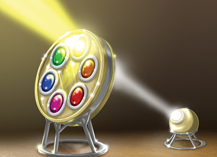

The Lens of Modes

模式透镜

An interface of any complexity is going to require modes.  To make sure your modes make the player feel powerful and in control, and do not confuse or overwhelm, ask yourself these questions:

稍有复杂度的界面就会需要模式。为了确保模式让玩家觉得有力量、有掌控感，而不是困惑或不知所措，请问自己以下问题：

1. What modes do I need in my game?  Why?

我的游戏需要哪些模式？为什么？

2. Can any modes be collapsed or combined?

是否有模式可以归并或组合？

3. Are any of the modes overlapping?  If so, can I put them on different input channels?

是否有模式相互重叠？如果有，我能否将它们分配到不同的输入通道？

4. When the game changes modes, how does the player know that?  Can the game communicate the mode change in more than one way?

游戏切换模式时，玩家如何得知？游戏能否用不止一种方式传达模式变化？

Artist credit: Patrick Collins

## 67½ · 隐喻

Review: ai-draft

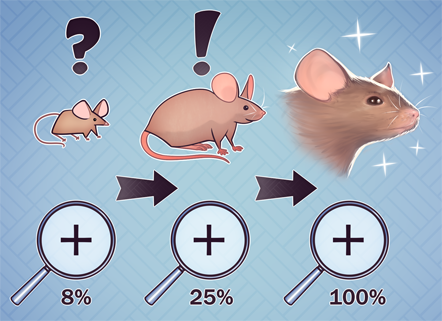

The Lens of Metaphor

隐喻透镜

Game interfaces often mimic interfaces to things that are already familiar to players. To make sure your metaphors are aiding players’ understanding, and not confusing them, ask yourself these questions:

游戏界面经常模仿玩家已经熟悉的事物的界面。为了确保隐喻帮助玩家理解，而不是让他们困惑，请问自己以下问题：

1. Is my interface already a metaphor for something else?

我的界面是否已经是另一种事物的隐喻？

2. If it is a metaphor, am I making the most of that metaphor? Or is the metaphor getting in the way?

如果它是隐喻，我是否充分利用了这个隐喻？还是隐喻反而造成了妨碍？

3. If it isn’t a metaphor, would it be more intuitive if it were?

如果它不是隐喻，改用隐喻是否会更直观？

Artist credit: Derek Hetrick

## 68 · 时刻

Review: ai-draft

The Lens of Moments

时刻透镜

Memorable moments are stars that make up the constellation of your interest curve.  To chart what is most important, ask yourself these questions:

难忘的时刻就像星辰，组成了兴趣曲线的星座。为了标出最重要的部分，请问自己以下问题：

1. What are the key moments in my game?

我的游戏有哪些关键时刻？

2. How can I make each moment as powerful as possible?

我如何让每个时刻尽可能有感染力？

Artist credit: Kim Kiser

## 69 · 兴趣曲线

Review: ai-draft

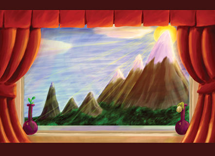

The Lens of Interest Curve

兴趣曲线透镜

What captivates the human mind often seems different for every person - but in fact it is remarkably similar for everyone.  To see how a player's interest in your experience changes over time, ask yourself these questions:

吸引人心的事物看起来常常因人而异，但实际上，对所有人来说都有惊人的相似之处。为了了解玩家对体验的兴趣如何随时间变化，请问自己以下问题：

1. If I draw an interest curve of my experience, how is it shaped?

如果画出这段体验的兴趣曲线，它是什么形状？

2. Does it have a hook?

它有吸引人入局的钩子吗？

3. Is there gradually rising interest, punctuated by periods of rest?

兴趣是否逐步上升，并穿插休息阶段？

4. Is there a grand finale, more interesting than everything else?

是否有一个比其他一切都更精彩的盛大结局？

5. What changes would give me a better interest curve?

哪些改变能让我得到更好的兴趣曲线？

6. Is there a fractural structure to my interest curve?  Should there be?

我的兴趣曲线是否具有分形结构？它应该有吗？

7. Do my intuitions about the interest curve match the observed interest of the players?  If I ask playtesters to draw an interest curve, what does it look like?

我对兴趣曲线的直觉，是否与观察到的玩家兴趣一致？如果让试玩者画出兴趣曲线，会是什么样？

Artist credit: Chris Daniel

## 70 · 内在吸引力

Review: ai-draft

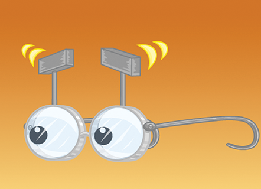

The Lens of Inherent Interest

内在吸引力透镜

Some things are just interesting.  Use this lens to be sure your game has inherently interesting qualities by asking these questions:

有些事物本身就很有趣。使用这面透镜，通过以下问题确保游戏具有内在吸引力：

1. What aspects of my game will capture the interest of the player immediately?

游戏的哪些方面会立刻吸引玩家的兴趣？

2. Does my game let the player see or do something they have never seen or done before?

我的游戏是否让玩家看到或做到以前从未见过或做过的事？

3. What base instincts does my game appeal to?  Can it appeal to more of them?

我的游戏吸引了哪些基本本能？能否吸引更多？

4. What higher instincts does my game appeal to?  Can it appeal to more of those?

我的游戏吸引了哪些高层次本能？能否吸引更多？

5. Does dramatic change and anticipation of dramatic change happen in my game?  How can it be more dramatic?

游戏中是否会发生戏剧性的变化，以及对这种变化的期待？如何让它更有戏剧性？

Artist credit: Patrick Mittereder

## 71 · 美

Review: ai-draft

The Lens of Beauty

美透镜

Beauty is mysterious.  Why, for example, do the most beautiful things have a touch of sadness about them?  Use this lens to contemplate the mysteries of beauty in your game by asking yourself these questions:

美是神秘的。例如，为什么最美的事物往往带着一丝忧伤？使用这面透镜，通过以下问题思考游戏中美的奥秘：

1. What elements make up my game?  How can each one be more beautiful?

哪些要素构成了我的游戏？如何让每个要素都更美？

2. Some things are not beautiful in themselves, but are beautiful in combination.  How can elements of my game be composed in a way that is poetic and beautiful?

有些事物本身并不美，但组合起来却很美。如何将游戏要素组织得富有诗意而美丽？

3. What does beauty mean within the context of my game?

在我的游戏语境中，美意味着什么？

Artist credit: Kyle Gabler

## 72 · 投射

Review: ai-draft

The Lens of Projection

投射透镜

One key indicator that someone is enjoying an experience is that they have projected their imaginations into it.  To examine whether your game is well suited to induce projection for your players, ask yourself these questions:

判断一个人是否享受某种体验，一个关键标志是他们是否已将想象力投射进去。为了审视游戏是否适合引发玩家的投射，请问自己以下问题：

1. What is there in my game that players can relate to?  What else can I add?

游戏中有什么能让玩家产生认同？我还能添加什么？

2. What is there in my game that will capture the players' imagination?  What else can I add?

游戏中有什么能抓住玩家的想象力？我还能添加什么？

3. Are there places in the game the players have always wanted to visit?

游戏里是否有玩家一直想去的地方？

4. Are there other characters in the game that the players would be interested to meet (or spy on)?

游戏里是否有玩家感兴趣、想结识（或暗中观察）的其他角色？

5. Do the players get to do things that they would like to do in real life, but can't?

玩家能否做现实中想做却做不到的事情？

6. Is there any activity in the game that once a player starts doing, it is hard to stop?

游戏里是否有某种活动，让玩家一旦开始就很难停下？

Artist credit: Kyle Gabler

## 73 · 故事机器

Review: ai-draft

The Lens of Story Machine

故事机器透镜

A good game is a machine that generates stories when people play it.  To make sure your story machine is as productive as possible, ask yourself these questions:

好游戏是一台在人们游玩时生成故事的机器。为了确保故事机器尽可能高产，请问自己以下问题：

1. How can I add more player choice?

我如何增加玩家的选择？

2. How can I allow more conflict to arise?

我如何让更多冲突出现？

3. How can I let players personalize the story?

我如何让玩家把故事变成属于自己的故事？

4. Does this game produce stories with good interest curves?

这个游戏是否会产生具有良好兴趣曲线的故事？

5. Are players excited to tell the story of what happened in the game?

玩家是否兴奋地想讲述游戏中发生的故事？

Artist credit: Jim Rugg

## 74 · 障碍

Review: ai-draft

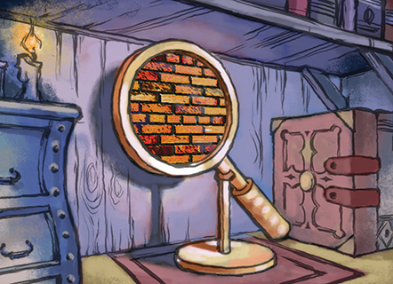

The Lens of Obstacle

障碍透镜

A goal with no obstacles is not worth pursuing.  Use this lens to make sure your obstacles are ones that your players will want to overcome.

没有障碍的目标不值得追求。用这面透镜确保你设置的是玩家愿意克服的障碍。

1. What is the relationship between the main character and the goal?  Why does the character care about it?

主角与目标是什么关系？角色为什么在意这个目标？

2. What are the obstacles between the character and the goal?

角色与目标之间有哪些障碍？

3. Is there an antagonist who is behind the obstacles?  What is the relationship between the protagonist and the antagonist?

是否有一个反派在幕后设置障碍？主角与反派是什么关系？

4. Do the obstacles gradually increase in difficulty?

障碍的难度是否逐渐提升？

5. Some say, "The bigger the obstacle, the better the story."  Are your obstacles big enough?  Can they be bigger?

有人说：“障碍越大，故事越好。”你的障碍足够大吗？还能更大吗？

6. Great stories often involve the protagonist transforming in order to overcome the obstacle.  How does your protagonist transform?

精彩的故事常常让主角为了克服障碍而发生转变。你的主角会如何转变？

Artist credit: Sam Yip

## 75 · 简单与超越

Review: ai-draft

The Lens of Simplicity and Transcendence

简单与超越透镜

To make sure you have the right mix of simplicity and transcendence, ask yourself these questions:

为了确保简单与超越搭配得当，请问自己以下问题：

1. How is my world simpler than the real world?  Can it be simpler in other ways?

我的世界在哪些方面比真实世界更简单？还能在哪些方面更简单？

2. What kind of transcendent power do I give to the player?  How can I give them even more without removing challenge from the game?

我赋予玩家哪种超越现实的力量？如何在保留游戏挑战的同时，给予他们更多力量？

3. Is my contribution of simplicity and transcendence contrived, or does it provide my players with a special kind of wish fulfillment?

我带来的简单与超越是否显得牵强，还是为玩家实现了某种特别的愿望？

Artist credit: Nick Daniel

## 76 · 英雄之旅

Review: ai-draft

The Lens of The Hero's Journey

英雄之旅透镜

Many heroic stories have similar structure.  Use this lens to make sure you haven't missed out on any elements that might improve your story.  Ask yourself these questions:

许多英雄故事有相似的结构。用这面透镜确保你没有遗漏可能改善故事的要素。请问自己以下问题：

1. Does my story have elements that qualify it as a heroic story?

我的故事是否具有使其成为英雄故事的要素？

2. If so, how does it match up with the structure of the Hero's Journey?

如果有，它与英雄之旅的结构如何对应？

3. Would my story be improved by including more archetypical elements?

加入更多原型要素，会让故事更好吗？

4. Does my story match this form so closely that it feels hackneyed?

我的故事是否太过贴合这种形式，以至于显得陈词滥调？

Artist credit: Chris Daniel

## 77 · 最奇怪的事物

Review: ai-draft

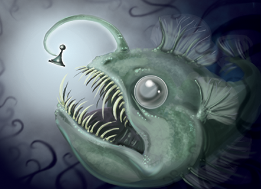

The Lens of The Weirdest Thing

最奇怪的事物透镜

Having weird things in your story can help give meaning to unusual game mechanics, capture the interest of the player, and make your world seem special.  Too much weirdness, though, will render your story puzzling and inaccessible.  To make sure your story is the good kind of weird, ask yourself these questions:

在故事中加入奇怪事物，可以帮助解释不寻常的游戏机制、吸引玩家兴趣，并让世界显得独特。但过于怪异又会让故事难懂、难以进入。为了确保故事的怪异恰到好处，请问自己以下问题：

1. What is the weirdest thing in my story?

我的故事中最奇怪的事物是什么？

2. How can I make sure that the weirdest thing doesn't confuse or alienate the player?

我如何确保最奇怪的事物不会让玩家困惑或疏远？

3. If there are multiple weird things, should I maybe get rid of, or coalesce some of them?

如果有多种奇怪事物，我是否该删去或合并其中一些？

4. If there is nothing weird in my story, is the story still interesting?

如果故事中没有任何奇怪事物，它还会有趣吗？

Artist credit: Reagan Heller

## 78 · 故事

Review: ai-draft

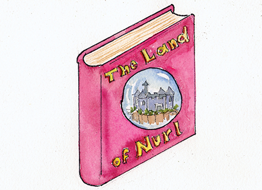

The Lens of Story

故事透镜

To be sure the story in your game is as good as it can be, ask yourself these questions:

为了确保游戏中的故事尽可能出色，请问自己以下问题：

1. Does my game really need a story?  Why?

我的游戏真的需要故事吗？为什么？

2. Why will players be interested in this story?

玩家为什么会对这个故事感兴趣？

3. How does the story support the other parts of the tetrad (aesthetics, technology, mechanics)?  Can it do a better job?

故事如何支持四大基本要素中的其他部分（美感、技术、机制）？能做得更好吗？

4. How do the other parts of the tetrad support the story?  Can they do a better job?

四大基本要素中的其他部分如何支持故事？能做得更好吗？

5. How can my story be better?

我的故事如何变得更好？

Artist credit: Diana Patton

## 79 · 自由

Review: ai-draft

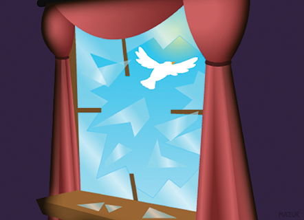

The Lens of Freedom

自由透镜

A feeling of freedom is one of the things that separates games from other forms of entertainment.  To make sure your players feel as free as possible, ask yourself these questions:

自由感是游戏区别于其他娱乐形式的特点之一。为了让玩家尽可能感到自由，请问自己以下问题：

1. When do my players have freedom of action?  Do they feel free at these times?

玩家什么时候有行动自由？在这些时候，他们觉得自由吗？

2. When are they constrained?  Do they feel constrained at these times?

玩家什么时候受到约束？在这些时候，他们觉得受约束吗？

3. Are there any places I can let them feel more free than they do now?

是否有些地方能让他们比现在感到更自由？

4. Are there any places where they are overwhelmed by too much freedom?

是否有些地方因自由过多而让他们不知所措？

Artist credit: Nathan Mazur

## 80 · 帮助

Review: ai-draft

The Lens of Help

帮助透镜

Deep down, everyone wants to be helpful.  To channel this helpful spirit toward engaging gameplay, ask yourself these questions:

在内心深处，每个人都希望能帮上忙。为了将这种助人精神引向吸引人的游戏体验，请问自己以下问题：

1. Within the context of the game, who is the player helping?

在游戏情境中，玩家正在帮助谁？

2. Can I make the player feel more connected to the characters who need help?

我能否让玩家与需要帮助的角色产生更深的联系？

3. Can I better tell the story of how meeting game goals helps someone?

我能否更好地讲述达成游戏目标如何帮助了某个人？

4. How can the helped characters show their appreciation?

得到帮助的角色可以如何表达感激？

Artist credit: Astro Leon-Jhong

## 81 · 间接控制

Review: ai-draft

The Lens of Indirect Control

间接控制透镜

Every designer has a vision of what they would like the players to do to have an ideal play experience.  To help ensure the players do these things of their own free will, ask yourself these questions:

每位设计师都设想过，为了获得理想的游玩体验，玩家应该做些什么。为了帮助确保玩家出于自己的自由意志做这些事，请问自己以下问题：

1. Ideally, what would I like the players to do?

理想情况下，我希望玩家做什么？

2. Can constraints get players to do it?

约束能让玩家这样做吗？

3. Can goals get the players to do it?

目标能让玩家这样做吗？

4. Can interface get the players to do it?

界面能让玩家这样做吗？

5. Can visual design get players to do it?

视觉设计能让玩家这样做吗？

6. Can game characters get players to do it?

游戏角色能让玩家这样做吗？

7. Can music or sound get players to do it?

音乐或声音能让玩家这样做吗？

8. Is there some other method I can use to coerce players towards ideal behavior without impinging on their feeling of freedom?

还有什么方法，能在不损害玩家自由感的情况下，促使他们采取理想行为？

Artist credit: Cheryl Ceol

## 82 · 共谋

Review: ai-draft

The Lens of Collusion

共谋透镜

Characters should fulfill their roles in the game world, but when possible, also serve as the minions of the game designer, ensuring an engaging experience for the player.  To make sure your characters are living up to this responsibility, ask yourself these questions:

角色应该履行其在游戏世界中的职责，但在可能时，也应充当游戏设计师的助手，确保玩家获得引人入胜的体验。为了确保角色履行了这项责任，请问自己以下问题：

1. What do I want the player to experience?

我想让玩家体验什么？

2. How can the characters help fulfill this experience, without compromising their goals in the game world?

角色如何在不违背自身游戏世界目标的情况下，帮助实现这种体验？

Artist credit: Nick Daniel

## 83 · 幻想

Review: ai-draft

The Lens of Fantasy

幻想透镜

Everyone has secret wishes and desires.  To be sure your world fulfills them, ask yourself these questions:

每个人都有隐秘的愿望与欲望。为了确保你的世界能满足它们，请问自己以下问题：

1. What fantasy does my world fulfill?

我的世界满足了什么幻想？

2. Who does the player fantasize about being?

玩家幻想成为谁？

3. What does my player fantasize about doing there?

玩家幻想在那里做什么？

Artist credit: Ryan Yee

## 84 · 世界

Review: ai-draft

The Lens of The World

世界透镜

The world of your game is a thing that exists apart.  Your game is a doorway to this magic place that exists only in the imagination of your players.  To ensure your world has power and integrity, ask yourself these questions:

游戏世界是一个独立存在的事物。你的游戏是通往这个神奇之地的门，而它只存在于玩家的想象中。为了确保世界有力量且完整自洽，请问自己以下问题：

1. How is my world better than the real world?

我的世界在哪些方面比现实世界更好？

2. Can there be multiple gateways to my world?  How do they differ?  How do they support each other?

能否有多个通往这个世界的入口？它们有何不同？如何相互支持？

3. Is my world centered on a single story, or could many stories happen here?

我的世界是围绕单一故事展开，还是可以在这里发生许多故事？

Artist credit: Nick Daniel

## 85 · 化身

Review: ai-draft

The Lens of The Avatar

化身透镜

The avatar is the player's gateway into the world of the game.  To ensure your avatar brings out as much of the player's identity as possible, ask yourself these questions:

化身是玩家进入游戏世界的入口。为了确保化身尽可能体现玩家的自我认同，请问自己以下问题：

1. Is my avatar an ideal form that will appeal to my players?

我的化身是否是一种能吸引玩家的理想形态？

2. Does my avatar have iconic qualities that let a player project themselves into the character?

我的化身是否具有图标化的特质，让玩家能将自己投射到角色身上？

Artist credit: Cheryl Ceol

## 86 · 角色功能

Review: ai-draft

The Lens of Character Function

角色功能透镜

To make sure your characters are doing everything your game needs them to do, ask yourself these questions:

为了确保角色完成游戏需要他们完成的所有事情，请问自己以下问题：

1. What are the roles I need the characters to fill?

我需要角色承担哪些职能？

2. What characters have I already imagined?

我已经构想了哪些角色？

3. Which characters map well to which roles?

哪些角色适合哪些职能？

4. Can any characters fill more than one role?

是否有角色可以承担不止一种职能？

5. Do I need to change the characters to better fit the roles?

我是否需要修改角色，让他们更适合这些职能？

6. DO I need any new characters?

我需要新角色吗？

Artist credit: Sam Yip

## 87 · 角色特质

Review: ai-draft

The Lens of Character Traits

角色特质透镜

To ensure that the traits of a character show in what they say and do, ask yourself these questions:

为了确保角色的特质体现在言行中，请问自己以下问题：

1. What traits define my character?

哪些特质定义了我的角色？

2. How do these traits manifest themselves in the words, actions, and appearance of my character?

这些特质如何体现在角色的语言、行动和外表中？

Artist credit: Nick Daniel

## 88 · 人际环状模型

Review: ai-draft

The Lens of Interpersonal Circumplex

人际环状模型透镜

The relationships between your characters can be understood by creating a graph with one axis labeled hostile/friendly, and the other labeled submissive/dominant.  Pick a character, put it in the middle, and plot out where other characters lie relative to that character.  Ask yourself these questions:

你可以画一张图来理解角色关系：一条轴标为敌意／友善，另一条轴标为顺从／支配。选一个角色放在中央，再标出其他角色相对这个角色的位置。请问自己以下问题：

1. Are there any gaps in the chart?  Why are they there?  Would it be better if they were filled?

图中是否有空白区域？为什么会有？填补它们是否会更好？

2. Are there "extreme characters" on the graph?  If not, would it be better if there were?

图中是否有“极端角色”？如果没有，加入是否会更好？

3. Are the character's friends in the same quadrant, or different quadrants?  What if that were different?

这个角色的朋友位于同一象限，还是不同象限？如果改变这一点，会怎样？

Artist credit: Kwame' Babb

## 89 · 角色关系网

Review: ai-draft

The Lens of The Character Web

角色关系网透镜

To better flesh out your characters' relationships, make a list of all your characters, and ask yourself these questions:

为了更充分地充实角色关系，列出所有角色，并问自己以下问题：

1. How, specifically, does each character feel about each of the others?

具体来说，每个角色对其他每个角色分别有什么感受？

2. Are there any connections unaccounted for?  How can I use those?

是否有尚未考虑的联系？我如何利用它们？

3. Are there too many similar connections?  How can they be more different?

是否有太多相似的联系？如何让它们更有区别？

Artist credit: Diana Patton

## 90 · 地位

Review: ai-draft

The Lens of Status

地位透镜

When people interact, they take on different behaviors depending on their status levels.  To make your characters more aware of each other, ask yourself these questions:

人们互动时，会根据自身地位采取不同的行为。为了让角色更能感知彼此的存在与关系，请问自己以下问题：

1. What are the relative status levels of the characters in my game?

游戏中各角色的相对地位如何？

2. How can they show appropriate status behaviors?

他们如何表现出与地位相符的行为？

3. Conflicts of status are interesting - how are my characters vying for status?

地位冲突很有趣——我的角色如何争夺地位？

4. How am I giving the player a chance to express status?

我如何给玩家表达地位的机会？

Artist credit: Chris Daniel

## 91 · 角色转变

Review: ai-draft

The Lens of Character Transformation

角色转变透镜

We pay attention to character transformations because we care about what might change us.  To ensure your characters are transforming in interesting ways, ask yourself these questions:

我们关注角色转变，是因为我们在意什么可能改变自己。为了确保角色以有趣的方式转变，请问自己以下问题：

1. How does each of my characters change throughout the game?

在整个游戏过程中，每个角色如何变化？

2. How am I communicating those changes to the player?  Can I communicate them more clearly, or more strongly?

我如何向玩家传达这些变化？能否传达得更清晰或更有力？

3. Is there enough change?

变化是否足够？

4. Are the changes surprising and interesting?

这些变化是否令人惊讶且有趣？

5. Are the changes believable?

这些变化可信吗？

Artist credit: Chris Daniel

## 92 · 内在矛盾

Review: ai-draft

The Lens of Inner Contradiction

内在矛盾透镜

A good game cannot contain properties that defeat the game's very purpose.  To remove those contradictory qualities, ask yourself these questions:

好游戏不能包含破坏游戏自身目的的特性。为了去除这些相互矛盾的特质，请问自己以下问题：

1. What is the purpose of my game?

我的游戏的目的是什么？

2. What are the purposes of each subsystem in my game?

游戏中每个子系统的目的是什么？

3. Is there anything at all in my game that contradicts these purposes?

游戏中是否有任何东西与这些目的相矛盾？

4. If so, how can I change that?

如果有，我如何改变这一点？

Artist credit: Nick Daniel

## 93 · 无名特质

Review: ai-draft

The Lens of The Nameless Quality

无名特质透镜

Certain things feel special and wonderful because of their natural, organic design.  To ensure your game has these properties, ask yourself these questions:

某些事物因为其自然、有机的设计而显得独特而美妙。为了确保游戏具有这些特性，请问自己以下问题：

1. Does my design have a special feeling of life, or do parts of my design feel dead?  What would make my design more alive?

我的设计是否有一种特别的生命感，还是某些部分显得死气沉沉？什么能让设计更有生命力？

2. Which of Alexander's fifteen qualities does my design have?

我的设计具有亚历山大提出的十五种特质中的哪些？

3. Could it have more of them, somehow?

能否以某种方式拥有更多这些特质？

4. Where does my design feel like myself?

我的设计在哪些地方让我感到它像我自己？

Artist credit: Chris Daniel

## 93½ · 临场感

Review: ai-draft

The Lens of Presence

临场感透镜

Presence is invisible, ephemeral, fragile, and central to human experience. To remember where your player really is, ask yourself these questions:

临场感看不见、转瞬即逝且脆弱，却是人类体验的核心。为了记住玩家真正身在何处，请问自己以下问题：

1. Is my player experiencing a sense of presence? Could it be stronger?

玩家是否正在体验临场感？它能更强吗？

2. What in my game is diminishing or breaking presence?

游戏中的什么在削弱或打破临场感？

3. What in my game is building or strengthening presence?

游戏中的什么在建立或加强临场感？

Artist credit: Josh Hendryx

## 94 · 氛围

Review: ai-draft

The Lens of Atmosphere

氛围透镜

Atmosphere is invisible and intangible.  But somehow it envelops us, permeates us, and makes us part of the world.  To make sure the atmosphere of your world is properly intoxicating, ask yourself these questions:

氛围无形无质，却以某种方式包围我们、渗透我们，让我们成为世界的一部分。为了确保世界的氛围足够令人沉醉，请问自己以下问题：

1. Without using words, how can I describe the atmosphere of my game?

不用语言，我如何描述游戏的氛围？

2. How can I use artistic control (both visual and audible) to deepen that atmosphere?

我如何通过艺术控制（视觉与听觉两方面）深化这种氛围？

Artist credit: Ryan Yee

## 95 · 观赏性

Review: ai-draft

The Lens of Spectation

观赏性透镜

For thousands of years, man has loved to sit and watch others play games - but only if the games are worth watching.  To make sure your game is spectator worthy, ask yourself these questions:

几千年来，人类都喜欢坐下来观看别人玩游戏——但前提是游戏值得观看。为了确保游戏值得观赏，请问自己以下问题：

1. Is my game interesting to watch?  Why or why not?

观看我的游戏有趣吗？为什么有趣或无趣？

2. How can I make it more interesting to watch?

我如何让它更值得观看？

Artist credit: Josh Hendryx

## 95½ · 可作弊性

Review: ai-draft

The Lens of Cheatability

可作弊性透镜

No one wants to worry about being beaten by a cheater - it makes you feel like a chump. To make sure your players trust your game, ask yourself these questions:

没人想担心被作弊者击败——那会让人觉得自己像个傻瓜。为了确保玩家信任游戏，请问自己以下问题：

1. Can players cheat at my game? How?

玩家能在我的游戏中作弊吗？如何作弊？

2. If players can cheat, will anyone notice?

如果玩家可以作弊，会有人察觉吗？

3. Do players trust my game?

玩家信任我的游戏吗？

Artist credit: Derek Hetrick

## 96 · 友谊

Review: ai-draft

The Lens of Friendship

友谊透镜

People love to play games with friends.  To make sure your game has the right qualities to let people make and keep friendships, ask yourself these questions:

人们喜欢和朋友一起玩游戏。为了确保游戏具有帮助人们建立并维持友谊的恰当特质，请问自己以下问题：

1. What kind of friendships are my players looking for?

玩家在寻找什么样的友谊？

2. How do my players break the ice?

玩家如何打破隔阂？

3. Do my players have enough chance to talk to each other?  Do they have enough to talk about?

玩家是否有足够的机会相互交谈？他们是否有足够的话题？

4. When is the moment they become friends?

他们在哪一刻成为朋友？

5. What tools do I give the players to maintain their friendships?

我为玩家提供了哪些维持友谊的工具？

Artist credit: Nick Daniel

## 97 · 表达

Review: ai-draft

The Lens of Expression

表达透镜

When players get a chance to express themselves, it makes them feel alive, proud, important, and connected.  To use this lens, ask yourself these questions:

当玩家有机会表达自己时，他们会感到充满活力、自豪、重要，并与他人相连。使用这面透镜时，请问自己以下问题：

1. How am I letting players express themselves?

我如何让玩家表达自己？

2. What ways am I forgetting?

我遗漏了哪些方式？

3. Are players proud of their identity?  Why or why not?

玩家为自己的身份感到自豪吗？为什么自豪或不自豪？

Artist credit: Nathan Mazur

## 98 · 社群

Review: ai-draft

The Lens of Community

社群透镜

To make sure your game fosters strong community, ask yourself these questions:

为了确保游戏能培育强大的社群，请问自己以下问题：

1. What conflict is at the heart of my community?

什么冲突位于我的社群核心？

2. How does architecture shape my community?

架构如何塑造我的社群？

3. Does my game support three levels of experience?

我的游戏是否支持三个经验层级？

4. Are there community events?

是否有社群活动？

5. Why do players need each other?

玩家为什么需要彼此？

Artist credit: Diana Patton

## 99 · 恶意滋扰

Review: ai-draft

The Lens of Griefing

恶意滋扰透镜

To make sure your griefing is minimized, ask yourself these questions:

为了尽量减少恶意滋扰，请问自己以下问题：

1. What systems in my game are easy to grief?

游戏中的哪些系统容易被用来恶意滋扰他人？

2. How can I make my game boring to grief?

我如何让在游戏中恶意滋扰变得无聊？

3. Am I ignoring any loopholes?

我是否忽略了任何漏洞？

Artist credit: Nick Daniel

## 100 · 热爱

Review: ai-draft

The Lens of Love

热爱透镜

If the creators of a game do not love it, the game will surely fail.  To use this lens, as yourself these questions:

如果游戏的创作者不热爱它，游戏必然会失败。使用这面透镜时，请问自己以下问题：

1. Do I love my project?  If not, how can I change that?

我热爱自己的项目吗？如果不热爱，我如何改变这一点？

2. Does everyone on the team love the project?  If not, how can that be changed?

团队中的每个人都热爱这个项目吗？如果不是，如何改变？

Artist credit: Nick Daniel

## 101 · 团队

Review: ai-draft

The Lens of The Team

团队透镜

To make sure your team is operating like a well-oiled machine, ask yourself these questions:

为了确保团队像一台运转顺畅的机器一样工作，请问自己以下问题：

1. Is this the right team for this project?  Why?

这个团队适合这个项目吗？为什么？

2. Is the team communicating objectively?

团队是否在客观地沟通？

3. Is the team communicating clearly?

团队是否在清晰地沟通？

4. Is the team comfortable with each other?

团队成员相处自在吗？

5. Is there an air of trust and respect amongst the team?

团队中是否有信任与尊重的氛围？

6. Is the team ultimately able to unify around decisions?

团队最终能否围绕决策形成一致？

Artist credit: Nick Daniel

## 102 · 文档

Review: ai-draft

The Lens of Documentation

文档透镜

To ensure you are writing the documents you need, and skipping the ones you don't, ask yourself these questions:

为了确保你编写真正需要的文档，并跳过不需要的文档，请问自己以下问题：

1. What do we need to remember while making this game?

制作这个游戏时，我们需要记住什么？

2. What needs to be communicated while making this game?

制作这个游戏时，需要沟通什么？

Artist credit: Nick Daniel

## 103 · 试玩测试

Review: ai-draft

The Lens of Playtesting

试玩测试透镜

Playtesting is your chance to see your game in action.  To ensure your playtests are as good as they can be, ask yourself these questions:

试玩测试让你有机会看到游戏实际运行的样子。为了确保试玩测试尽可能有效，请问自己以下问题：

1. Why are we doing a playtest?

我们为什么进行试玩测试？

2. Who should be there?

谁应该参加？

3. Where should we hold it?

应该在哪里举行？

4. What will we look for?

我们要观察什么？

5. How will we get the information we need?

我们如何获得所需的信息？

Artist credit: Chris Daniel

## 104 · 技术

Review: ai-draft

The Lens of Technology

技术透镜

To make sure you are using the right technologies in the right way, ask yourself these questions:

为了确保你以恰当的方式使用恰当的技术，请问自己以下问题：

1. What technologies will help deliver the experience I want to create?

哪些技术有助于实现我想创造的体验？

2. Am I using these technologies in ways that are foundational or decorational?

我是在将这些技术用作基础，还是用作装饰？

3. If I'm not using them foundationally, should I be using them at all?

如果没有把它们用作基础，我是否还应该使用它们？

4. Is this technology as cool as I think it is?

这项技术真的有我想的那么酷吗？

5. Is there a "disruptive technology" I should consider instead?

是否有一种“颠覆性技术”值得我转而考虑？

Artist credit: Joseph Grubb

## 105 · 水晶球

Review: ai-draft

The Lens of The Crystal Ball

水晶球透镜

If you would like to know the future of a particular game technology, ask yourself these questions, and make your answers as concrete as possible:

如果你想了解某项游戏技术的未来，请问自己以下问题，并尽可能给出具体答案：

1. What will __________ be like two years from now?  Why?

两年后，__________ 会是什么样？为什么？

2. What will __________ be like four years from now?  Why?

四年后，__________ 会是什么样？为什么？

3. What will __________ be like ten years from now?  Why?

十年后，__________ 会是什么样？为什么？

Artist credit: Diana Patton

## 106 · 乌托邦

Review: ai-draft

The Lens of Utopia

乌托邦透镜

To be sure you are headed to a better world, ask yourself these questions:

为了确保你正朝着更美好的世界前进，请问自己以下问题：

1. Am I creating something that feels magical?

我是否正在创造某种让人感觉神奇的东西？

2. Do people get excited just hearing about what I am making?  Why or why not?

人们是否仅仅听说我在做什么，就感到兴奋？为什么会或不会？

3. Does my game advance the state of the art in a meaningful way?

我的游戏是否以有意义的方式推动了现有最高水平的进步？

4. Does my game make the world a better place?

我的游戏让世界变得更好了吗？

Artist credit: Ryan Yee

## 107 · 客户

Review: ai-draft

The Lens of The Client

客户透镜

If you are making a game for someone else, you should probably know what they want.  Ask yourself these questions:

如果你在为别人制作游戏，你大概应该知道他们想要什么。请问自己以下问题：

1. What does the client say they want?

客户说他们想要什么？

2. What does the client think they want?

客户认为自己想要什么？

3. What does the client really want, deep down in their heart?

在内心深处，客户真正想要什么？

Artist credit: Kyle Gabler

## 108 · 提案

Review: ai-draft

The Lens of The Pitch

提案透镜

To ensure your pitch is as good as it can be, ask yourself these questions:

为了确保提案尽可能出色，请问自己以下问题：

1. Why are you pitching this game to the client?

你为什么向客户推介这个游戏？

2. What will you consider "a successful pitch"?

你认为什么才算“一次成功的提案”？

3. What's in it for the people you are pitching to?

你的提案能给听众带来什么好处？

4. What do the people you are pitching to need to know about your game?

听取提案的人需要了解游戏的哪些信息？

Artist credit: Nathan Mazur

## 109 · 利润

Review: ai-draft

The Lens of Profit

利润透镜

Profits keep the game industry alive.  Ask these questions to help your game become profitable:

利润维持着游戏产业的生命。请用以下问题帮助游戏实现盈利：

1. Where does the money go in my game's business model? Why?

在我的游戏商业模式中，钱流向哪里？为什么？

2. How much will it cost to produce, market, and distribute this game?  Why?

制作、营销和发行这个游戏要花多少钱？为什么？

3. How many units will this game sell?  Why do I think that?

这个游戏能卖出多少份？我为什么这样认为？

4. How many units need to sell before my game breaks even?

需要卖出多少份，游戏才能收支平衡？

Artist credit: Nick Daniel

## 110 · 改变

Review: ai-draft

The Lens of Transformation

改变透镜

Games create experiences, and experiences change people.  To make sure only the best changes happen to your players, ask yourself these questions:

游戏创造体验，体验改变人。为了确保玩家只发生最好的改变，请问自己以下问题：

1. How can my game change players for the better?

我的游戏可能如何让玩家变得更好？

2. How can my game change players for the worse?

我的游戏可能如何让玩家变得更糟？

Artist credit: Nathan Mazur

## 111 · 责任

Review: ai-draft

The Lens of Responsibility

责任透镜

To live up to your obligations as a game designer, ask yourself this question:

为了履行作为游戏设计师的义务，请问自己这个问题：

1. Does my game help people?  How?

我的游戏帮助了人们吗？如何帮助？

Artist credit: Zachary D. Coe

## 112 · 渡鸦

Review: ai-draft

The Lens of The Raven

渡鸦透镜

To remember to only work on what is important, ask yourself this question:

为了提醒自己只做重要的事，请问自己这个问题：

1. Is making this game worth my time?

制作这个游戏值得我投入时间吗？

Artist credit: Tom Smith

## ∞ · 你的秘密目的

Review: ai-draft

The Lens of Your Secret Purpose

你的秘密目的透镜

To make sure you are working towards your one true purpose, ask yourself the only question that matters:

为了确保你正朝着自己唯一真正的目的努力，请问自己这个唯一重要的问题：

1. Why am I doing this?

我为什么要做这件事？

Artist credit: Todd Swanson
